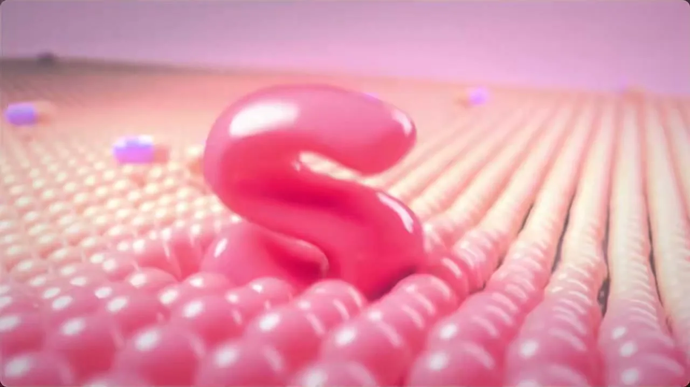
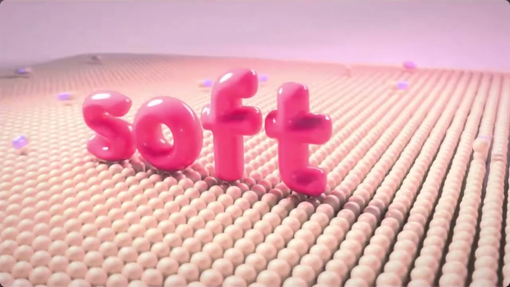
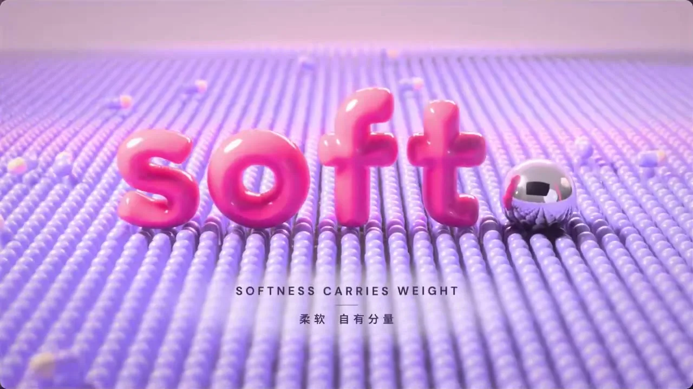

# 15 种视频风格 · 与内容无关的提示词图鉴

👉 **在线图鉴(一键复制、看逐帧证据):https://chenyuxiaojin.github.io/opus55-video-style-prompts/**

样片来自 [@VincentWei93 的展示视频](https://x.com/VincentWei93/status/2104957548797604116),15 种风格全部由 Claude Opus 5.5 写代码制作。本仓库把每种风格(10 秒、约 300 帧)交给一个独立 AI 子 agent 逐帧全部过目,剥离样片讲的具体内容,只留配色、形状、材质、排版、动效节奏、实现手法等**技巧层**,写成尽量精简、可直接复用的提示词(中 / 英)。

**用法**:复制下面任一风格的提示词 → 贴给 Claude Code 等编程 agent → 把最后一行 `{在这里写你的内容}` 换成你自己的内容。

<table><tr><td align=center><a href="prompts/01-frame-by-frame-hand-drawn.md"><br>01 逐帧手绘</a></td><td align=center><a href="prompts/02-isometric-2.5d.md"><br>02 等轴2.5D</a></td><td align=center><a href="prompts/03-flat-vector.md"><br>03 扁平矢量</a></td><td align=center><a href="prompts/04-single-line-art.md"><br>04 线条动画</a></td><td align=center><a href="prompts/05-3d-render.md"><br>05 3D渲染</a></td></tr><tr><td align=center><a href="prompts/06-shape-morph.md"><br>06 形变动画</a></td><td align=center><a href="prompts/07-sticker-explainer.md"><br>07 贴纸风科普</a></td><td align=center><a href="prompts/08-cyberpunk-hud-(fui).md"><br>08 赛博朋克HUD</a></td><td align=center><a href="prompts/09-collage-cut-out.md"><br>09 拼贴剪贴</a></td><td align=center><a href="prompts/10-aurora-glassmorphism.md"><br>10 弥散渐变玻璃拟态</a></td></tr><tr><td align=center><a href="prompts/11-geometric-bauhaus-construction.md"><br>11 几何构成包豪斯</a></td><td align=center><a href="prompts/12-retro-synthwave-vhs.md"><br>12 复古Synthwave</a></td><td align=center><a href="prompts/13-16-bit-pixel-art.md"><br>13 像素风</a></td><td align=center><a href="prompts/14-liquid-motion.md"><br>14 液态流动</a></td><td align=center><a href="prompts/15-variety-show-captions.md"><br>15 综艺花字</a></td></tr></table>

## 01 · 逐帧手绘 <sub>Frame-by-Frame Hand-Drawn</sub>

> 一拍二线条沸腾,纸上的手温

  

```text
逐帧手绘复古漫画动画。招牌:一拍二重绘、不停抖的墨黑粗描边;暖米白纸底上只用两种饱和暖色加墨黑平涂;最猛一下砸满屏漫画星爆。
① 造型与材质:任何主体都画成圆胖夸张的平涂,墨黑描边粗细不匀,暗面用手绘排线;整幅画像一张动画纸,角落带手写场号与张数小签。
② 配色与背景:纸纹铺满画面;一主一辅两种暖色加墨黑,不添色、无渐变;主体背后垫一团淡柔圆光晕。
③ 运动规律:默认一拍二,快动作一拍一;每换一张线条整体轻颤;动作靠挤压拉伸、残影、速度线;最强节拍插满屏星爆,底色在纸、墨、主色间硬闪;只硬切,不推拉。
画面里出现什么、怎么编排,全部由内容决定;风格只决定它们怎么被画出来、怎么动。
内容:{在这里写你的内容}
```

<details><summary>English prompt</summary>

```text
Frame-by-frame hand-drawn retro comic animation. Signature: thick ink-black outlines redrawn on twos so the lines never stop boiling; only two saturated warm colors plus ink black, flat-filled on warm off-white paper; the biggest hit lands as a full-screen comic starburst.
1) Form & material: render any subject as chubby, exaggerated flat shapes wrapped in uneven ink outlines, shadows done with hand hatching; the whole frame reads as a sheet of animation paper, with small handwritten scene and drawing-number tags in the corners.
2) Color & ground: paper grain covers the entire frame; one main and one secondary saturated warm color plus ink black, nothing more, no gradients; a pale, soft-edged round glow sits behind the subject.
3) Motion: on twos by default, fast actions on ones; every new drawing makes all lines tremble slightly; actions are sold with squash and stretch, smears and speed lines; the strongest beat gets full-screen starburst frames, the ground flashing hard between paper, ink black and the main color; hard cuts only, no push-ins or zooms.
What appears on screen and how it is arranged is decided entirely by the content; the style only decides how things are drawn and how they move.
Content: {your content here}
```

</details>

## 02 · 等轴2.5D <sub>Isometric 2.5D</sub>

> 桌面微缩模型,一格一格自己长出来

  

```text
等轴微缩积木风。招牌：锁死正交等轴视角；万物拆成圆角哑光黏土小块；逐格错峰拼出来。
① 造型与材质：无透视，平行线不汇聚；任何主体按同一方格单元切成圆角小块拼成，顶亮侧暗，像桌面微缩模型；哑光黏土，柔和漫射光，贴地软阴影，细节极简。
② 配色与背景：浅薰衣草紫柔雾渐变底；主体以素白和低饱和粉彩为主，同色系明暗分面；一小块深靛压重心。
③ 运动规律：形体逐格错峰落位或拔高，短促缓出带轻回弹，连续顺滑带运动模糊；镜头保持等轴角度，只缓慢平移或推拉。
画面里出现什么、怎么编排,全部由内容决定;风格只决定它们怎么被画出来、怎么动。
内容:{在这里写你的内容}
```

<details><summary>English prompt</summary>

```text
Isometric clay-block miniature. Signatures: a locked orthographic isometric view; everything broken into rounded matte clay cubes; it assembles cell by cell, staggered.
1 Form & material: no perspective, parallel lines never converge; any subject is cut into rounded blocks on one shared square unit, bright tops and darker sides, like a tabletop miniature; matte clay surface, soft diffuse light, soft contact shadows, minimal detail.
2 Color & background: a soft lavender haze background that deepens toward the bottom; subjects mostly off-white and low-saturation pastels, faces separated by lighter/darker tones of the same hue; one small deep-indigo mass anchors the eye.
3 Motion: forms drop into place or rise cell by cell in a staggered cascade, quick ease-out with a slight bounce, continuous and smooth with motion blur; the camera keeps the isometric angle and only slowly pans or dollies.
What appears on screen and how it is arranged is decided entirely by the content; the style only decides how it is drawn and how it moves.
Content: {your content here}
```

</details>

## 03 · 扁平矢量 <sub>Flat Vector</sub>

> 纯色几何零阴影,一颗圆点弹出全片节奏

  

```text
电光蓝弹跳扁平风：电光蓝铺底撞珊瑚红、薄荷绿、明黄纯色块；一颗珊瑚红圆点串起画面；落位必压扁回弹、迸放射短线。
① 造型与材质：主体拆成圆、圆角矩形、胶囊的无描边纯色块，零阴影零渐变；细节用同色小圆点阵列，纵深靠浅一档同色剪影叠层。
② 配色与背景：电光蓝占大半，红只点焦点，绿、黄、奶油白作次要块面，深藏青压暗部；背景纯色平铺。
③ 运动规律：下落拉长、触地压扁、过冲回弹，落点迸短线和涟漪；元素错开弹入；快移带方向模糊；换场由红点胀成满屏圆擦入。
画面里出现什么、怎么编排,全部由内容决定;风格只决定它们怎么被画出来、怎么动。
内容:{在这里写你的内容}
```

<details><summary>English prompt</summary>

```text
Electric-blue bouncy flat style: an electric-blue field dominating the frame with solid coral-red, mint-green and sunflower-yellow blocks; one solid coral-red dot threads every shot together; every landing squashes, rebounds and bursts short radial ticks.
1) Form & material: break any subject into outline-free solid blocks built only from circles, rounded rectangles and pills, zero shadow, zero gradient; detail is arrays of small same-color dots, depth is layered silhouettes one shade lighter in the same hue.
2) Color & background: electric blue covers most of the frame, coral red is reserved for the focal point, mint, yellow and cream share secondary blocks, deep navy carries the darks; backgrounds are flat solid fields.
3) Motion: falling elements stretch, squash on contact and overshoot back, the impact point bursts radial ticks and a flat elliptical ripple; groups pop in with staggered timing; fast moves carry directional motion blur; scene changes happen as the red dot swells into a full-screen circle of color that wipes into the next frame.
What appears on screen and how it is arranged is decided entirely by the content; the style only decides how things are drawn and how they move.
Content: {your content here}
```

</details>

## 04 · 线条动画 <sub>Single-Line Art</sub>

> 一根金线不离纸,留白即画面

  

```text
单线金描风:一根不断的金线一笔画出一切,笔尖拖着白热光点,暗蓝底上只有金线。
① 造型与材质:任何物体只勾外形,由同一根细线连续画成,物与物之间也被这根线串起;不提笔、不铺块面,只在要强调处让一个闭合形填成实金。
② 配色与背景:深海军蓝近黑底,四角压暗;线是低饱和暖金,刚画的一段偏白发亮;大半留空。
③ 运动规律:笔尖持续前进,线永远在被画出来,折角略收一拍;镜头平移跟住笔尖;线一闭合,金色由外向内瞬间灌满并荡出一圈光;要看全貌时才缓缓拉远。
画面里出现什么、怎么编排,全部由内容决定;风格只决定它们怎么被画出来、怎么动。
内容:{在这里写你的内容}
```

<details><summary>English prompt</summary>

```text
Single-Line Gold style: one unbroken gold line draws everything in a single stroke, its tip trailing a white-hot spark; on a dark navy ground there is nothing but gold line.
① Form & material: every subject is outline only, drawn by the same thin continuous line, which also travels from one subject to the next to join them; never lift the pen or split into separate strokes. No filled areas, except one closed shape at a moment of emphasis that fills solid gold with a soft halo.
② Color & background: deep navy, near-black ground, darkened toward the corners; the line is a desaturated warm gold, with the freshly drawn stretch glowing whitish before settling back to gold; most of the frame stays empty.
③ Motion: the tip keeps moving, so the line always reads as being drawn right now, easing for a beat at sharp corners; the camera pans to stay with the tip; when the line closes a shape, gold floods in from the edge inward in an instant and a ring of light ripples out; the camera slowly pulls back only when the whole picture needs to be seen.
What appears on screen and how it is arranged is decided entirely by the content; the style only decides how things are drawn and how they move.
Content: {your content here}
```

</details>

## 05 · 3D渲染 <sub>3D Render</sub>

> 粉彩充气质感,软糯落地有分量

  

```text
风格:充气糖果三维棚拍。招牌:万物圆胖鼓胀、釉亮如硬糖;大块表面由密排同款小圆粒构成;落点必压陷回弹。
①造型与材质:任何主体都做成充气般圆胖、无棱角的实心体,表面釉亮,反光柔而大块。承托面与大块面不做平板,由无数同款小圆粒密排成软颗粒肌理,受压下陷、被撞弹散。
②配色与背景:整体高明度低饱和的邻近色粉彩,天地同色系靠明暗分层;只有主角用一个高饱和色;可点缀镜面金属;无纯黑。柔和棚光包裹,焦外虚化,远处发雾。
③运动规律:物体从空中落下,触地压扁再弹回,把周围颗粒压出涟漪;元素逐个错拍进场;镜头一镜到底缓推缓绕;换色从接触点向外扩散。
画面里出现什么、怎么编排,全部由内容决定;风格只决定它们怎么被画出来、怎么动。
内容:{在这里写你的内容}
```

<details><summary>English prompt</summary>

```text
Style: inflated candy 3D studio render. Signatures: every form is chubby, puffed and glossy like hard candy; large surfaces are built from densely packed identical tiny round beads; every landing dents and rebounds.
1 Form & material: render any subject as a balloon-plump solid with no sharp edges, a glazed skin and broad soft reflections. Supporting and large surfaces are never flat slabs but a soft granular field of countless identical beads that sink under pressure and scatter on impact.
2 Color & background: high-lightness, low-saturation analogous pastels overall; ground and sky share one hue family, separated by value; only the hero carries one saturated color; mirror chrome may accent; no pure black. Wrapped in soft studio light, defocused background, hazy distance.
3 Motion: objects drop from above, squash on contact and spring back, pressing ripples into the surrounding beads; elements enter one by one, staggered; the camera holds one continuous take with a slow push and orbit; color changes spread outward from the point of contact.
What appears on screen and how it is arranged is entirely decided by the content; the style only decides how things are drawn and how they move.
Content: {your content here}
```

</details>

## 06 · 形变动画 <sub>Shape Morph</sub>

> 一个形状连续变身,底色随形翻页

  

```text
形变动画:全片只有一个居中实心剪影,从不切走,轮廓一路变身成下一个形状;换段时新底色从剪影处软边圆晕开铺满。
① 造型与材质:任何主体都概括成圆角粗实心剪影,无描边无细节,带一道斜向浅色折面;整屏覆细纸纹。
② 配色与背景:底永远是满屏高饱和纯色,与剪影明度反差强;三四个鲜艳色轮流当底,间或回到米白或近黑。
③ 运动规律:形与形靠轮廓连续变形衔接,可拉长、分裂、融合,不淡化不硬切;每形定住片刻再变,到位时压扁再弹回,快移带方向模糊。
画面里出现什么、怎么编排,全部由内容决定;风格只决定它们怎么被画出来、怎么动。
内容:{在这里写你的内容}
```

<details><summary>English prompt</summary>

```text
Shape Morph: the whole piece has only one centered solid silhouette; it is never cut away, its outline keeps transforming into the next shape; at each section change the new background color blooms out from the silhouette as a soft-edged circle until it fills the frame.
1 Form & material: reduce any subject to a bold, round-cornered solid silhouette, no outlines, no inner detail, just one diagonal lighter fold facet; fine paper grain over the whole frame.
2 Color & background: the background is always one full-bleed saturated flat color with strong value contrast against the silhouette; three or four vivid colors take turns as the ground, occasionally returning to off-white paper or near-black.
3 Motion: shapes become one another through continuous outline interpolation—stretching, splitting, merging—never crossfading or hard-cutting; each form holds briefly before changing, squashes and rebounds as it lands, fast moves carry directional blur.
What appears on screen and how it is arranged is entirely decided by the content; the style only decides how it is drawn and how it moves.
Content: {your content here}
```

</details>

## 07 · 贴纸风科普 <sub>Sticker Explainer</sub>

> 白描边贴纸,一镜推到底的长画布科普

  

```text
实物贴纸信息图,招牌:粗白边照片贴纸、深色圆角方块、带拖影的急速运镜。
① 造型与材质:任何主体都抠成真实照片,包粗白边、落短软投影,可微斜;数量与类别拆成大小一致的深色圆角方块,一块一单位,靠堆叠表达多少与归属。
② 配色与背景:高明度冷灰底,极淡点阵;近黑画方块与字;只留一个高饱和强调色,只点重点;其余近乎无彩。
③ 运动规律:元素弹入微过冲;方块错峰飞起、边飞边歪、落成新排列;换段不切不淡,整屏急推急摇带强方向运动模糊,随即近乎静止。
画面里出现什么、怎么编排,全部由内容决定;风格只决定它们怎么被画出来、怎么动。
内容:{在这里写你的内容}
```

<details><summary>English prompt</summary>

```text
Photo-sticker infographic. Signatures: thick-white-bordered photo stickers, dark rounded tiles, smeared fast camera whips.
(1) Form & material: cut any subject out as a real photo, wrap it in a thick white border with a short soft shadow, optionally slightly tilted; break quantities and categories into identical dark rounded tiles, one tile per unit, so stacking shows how many and what belongs where.
(2) Color & ground: bright cool-gray ground with a very faint dot grid; near-black for tiles and type; exactly one saturated accent, only on key points; everything else nearly colorless.
(3) Motion: elements pop in with slight overshoot; tiles lift off in a stagger, tilt in flight and land in a new arrangement; no hard cuts or fades - between sections the whole frame whips or pushes with strong directional motion blur, then settles almost still.
What appears on screen and how it is arranged is decided entirely by the content; the style only decides how things are drawn and how they move.
Content: {your content here}
```

</details>

## 08 · 赛博朋克HUD <sub>Cyberpunk HUD (FUI)</sub>

> 暗底青光细线界面,高潮一瞬转琥珀

  

```text
FUI瞄准仪表风。招牌:主体被分段刻度圆环加准星锁在中央;四周细线框读数,一个大数字始终跳动;近黑底只亮青色细线,关键时整屏转琥珀。
①造型与材质:全用发光细线、刻度、点线勾出,不填实色;主体成线框轮廓,如被测量;读数带角括号。
②配色与背景:底近黑带冷暗角;单一青色靠亮度分主次,近白点焦点;琥珀表警示,来时取代青色。
③运动规律:入场如开机,亮线拉开成准星,圆弧沿刻度描出,字逐行打出;圆环缓转、扫描掠过、数字滚动;转态先闪切片错位再换色。
画面里出现什么、怎么编排,全部由内容决定;风格只决定它们怎么被画出来、怎么动。
内容:{在这里写你的内容}
```

<details><summary>English prompt</summary>

```text
FUI targeting-instrument style. Signatures: the subject is locked dead-center by segmented tick rings and a crosshair; it is surrounded by hairline-framed readouts with one big number always ticking; only cyan glowing hairlines on near-black, and at the critical moment the whole screen turns amber.
1. Form & material: everything drawn in glowing hairlines, ticks and dotted strokes, no solid fills; the subject becomes a wireframe or dot-matrix outline, as if scanned by an instrument; readouts carry corner brackets, small labels beside one big number.
2. Color & background: near-black with a cool vignette; a single cyan ranked only by brightness, rare near-white for focus; amber means alert, and when it arrives it replaces the cyan.
3. Motion: entrances feel like a device powering on — a bright line opens into the crosshair, arcs draw along their ticks, text types out line by line; while running, rings turn slowly, scans sweep, numbers roll; a state change is preceded by a quick slice-offset glitch, then the color switches.
What appears on screen and how it is arranged is decided entirely by the content; the style only decides how things are drawn and how they move.
Content: {your content here}
```

</details>

## 09 · 拼贴剪贴 <sub>Collage Cut-Out</sub>

> 剪报网点纸片,12帧逐格拍上

  

```text
剪报拼贴风:万物都是剪下的纸片,照片一律粗网点黑白,在牛皮纸上逐格拍上去。
① 造型与材质:任何主体都做成实物剪片——照片转粗网点灰阶,插图取老版画线刻;外缘留不规整白边或撕成毛边,带薄投影、略歪斜,可用胶带固定;纸片层层压叠,不靠透视出纵深。
② 配色与背景:牛皮纸底,带纤维与暗角;主体为报纸米白与油墨黑的高反差灰阶,彩图也压成褪色网点;唯一强色是一种印刷红,只以整块平涂纸片出现。
③ 运动规律:一拍二到一拍三逐格步进,不做顺滑补间;纸片被一下拍上,冲大、回弹、定死;揭示与换场靠剪开、撕开、掀起纸层。
画面里出现什么、怎么编排,全部由内容决定;风格只决定它们怎么被画出来、怎么动。
内容:{在这里写你的内容}
```

<details><summary>English prompt</summary>

```text
Cut-and-paste newsprint collage: everything is a scrap of paper, every photo is coarse black-and-white halftone, slapped onto kraft paper one stepped frame at a time.
1) Form and material: treat any subject as a physical cutting — photos become grainy halftone greyscale, drawings look like old engraved line art; give each piece a ragged white cut border or a torn fibrous edge, a thin drop shadow and a slight tilt, optionally taped down. Scraps pile on top of each other; depth comes from stacking, never perspective.
2) Color and ground: the ground is fibrous kraft paper with a vignette; subjects sit in high-contrast newsprint cream and ink black, and any color imagery is pressed into faded halftone. The single strong color is one printing red, used only as solid flat paper pieces and never dominant.
3) Motion: stepped animation on twos to threes, no smooth tweening; pieces land as if slapped down by hand — overshoot, bounce back, then lock dead still. Reveals and scene changes happen by cutting, tearing or peeling a paper layer to expose the one beneath.
What appears on screen and how it is arranged is decided entirely by the content; the style only decides how things are drawn and how they move.
Content: {your content here}
```

</details>

## 10 · 弥散渐变玻璃拟态 <sub>Aurora Glassmorphism</sub>

> 极光暗场上浮磨砂玻璃,液态透镜折光

  

```text
「极光玻璃」:暗场蓝紫青极光,万物皆磨砂玻璃,液态透镜滑过放大扭弯。
① 造型与材质:任何主体都是大圆角磨砂玻璃片,背光晕染进片内,轮廓一线白亮高光;多片前后错层、微透视倾斜。透明厚玻璃透镜经过处,形与字鼓起放大,边缘泛彩虹色散。
② 配色与背景:近黑冷底压暗角;几团巨大柔焦光互相晕染,蓝主、紫青辅,无色带;前景只用白与半透明白。
③ 运动规律:全程顺滑;背景光如极光缓缓变形;玻璃片轻浮漂移带层间视差;元素由虚到实浮现,失焦后退离场;透镜缓慢游走。
画面里出现什么、怎么编排,全部由内容决定;风格只决定它们怎么被画出来、怎么动。
内容:{在这里写你的内容}
```

<details><summary>English prompt</summary>

```text
"Aurora Glass" style, three signatures: a blue-violet-cyan aurora glowing in a dark void; every subject rendered as translucent frosted glass; a liquid-glass lens that glides over things, magnifying and bending whatever lies beneath.
1 Form & material: turn any subject into large-radius frosted glass panes; the light behind them diffuses and tints into the pane, leaving only a hairline bright highlight on the outline. Panes sit in staggered depth with a slight perspective tilt. The lens is thick clear glass: shapes and text under it bulge and enlarge, edges fringed with rainbow dispersion.
2 Color & background: near-black cool ground with darkened corners; a few huge soft-focus glows bleed into each other, blue dominant, violet and cyan secondary, no banding. Foreground uses only white and translucent white, never solid color.
3 Motion: smooth and continuous throughout; background light shifts and morphs slowly like an aurora; panes float gently with parallax between layers; elements resolve from blur to sharp, and exit by defocusing and receding; the lens wanders slowly.
What appears on screen and how it is arranged is decided entirely by the content; the style only decides how it is drawn and how it moves.
Content: {your content here}
```

</details>

## 11 · 几何构成包豪斯 <sub>Geometric Bauhaus Construction</sub>

> 三原色几何块踩着节拍在网格上搭建

  

```text
包豪斯几何构成。招牌:任何主体都用圆、半圆、扇形、方块、三角、粗黑条拼出;只用红黄蓝加黑,落在暖米白纸上;形间露着细黑构图线、对位十字和支点圆点。
① 造型与材质:边缘锐利,纯平涂,无渐变阴影圆角;纸面只带极淡模块网格。
② 配色与背景:三原色高饱和不混色,黑色压重量,米白留白占大半,非对称平衡。
③ 运动规律:踩稳节拍一次只动一件,先现对位十字,再从该点展开、滑入或绕支点转;快起快停带运动模糊,落定不回弹;换段时整幅碎成小格翻转散开再重拼。
画面里出现什么、怎么编排,全部由内容决定;风格只决定它们怎么被画出来、怎么动。
内容:{在这里写你的内容}
```

<details><summary>English prompt</summary>

```text
Bauhaus geometric construction. Signature: every subject is broken down and rebuilt only from flat circles, semicircles, quarter-circles, squares, triangles and thick black bars; only the red-yellow-blue primaries plus black, on warm off-white paper; thin black construction lines, registration crosshairs and pivot dots stay visible between the shapes, like a poster caught mid-construction.
1 Form & material: razor-sharp edges, perfectly flat, no gradients, shadows or rounded corners; the paper carries only a very faint module grid.
2 Color & background: saturated primaries that never blend; black adds weight; off-white space dominates; asymmetric balance.
3 Motion: on a steady beat, one piece moves at a time — a crosshair or hairline appears first, then the shape unfolds from that point, slides in, or swings about a pivot; fast start, fast stop, directional motion blur, settles with no bounce; between sections the whole composition shatters into small tiles that flip, scatter and reassemble.
What appears on screen and how it is arranged is decided entirely by the content; the style only decides how it is drawn and how it moves.
Content: {your content here}
```

</details>

## 12 · 复古Synthwave <sub>Retro Synthwave VHS</sub>

> 霓虹网格落日,录像带回放

  

```text
风格:八十年代合成器浪潮录像带。招牌:暗底霓虹发光线、流向镜头的发光透视线、整帧录像带质感。
① 造型与材质:任何主体都画成强辉光细线框;实体用水平条纹切开的暖渐变,或上冷下暖的镜面铬,高光起星芒。纵深一律由朝远处消失点收束的发光透视线组织。
② 配色与背景:近黑深紫大面积压底,洋红为主、青为辅,暖金到珊瑚渐变是唯一暖点;亮色只占小面积。整帧叠扫描线、色差、细噪点和角落录像屏显。
③ 运动规律:连续平滑不抽帧;透视线匀速流向镜头;元素从镜头前推入急停,伴一闪白光;霓虹闪几下才亮;偶发横向撕裂。
画面里出现什么、怎么编排,全部由内容决定;风格只决定它们怎么被画出来、怎么动。
内容:{在这里写你的内容}
```

<details><summary>English prompt</summary>

```text
Style: 80s synthwave on VHS. Signatures: neon glow lines on a dark base, glowing perspective lines streaming toward the camera, full-frame videotape texture.
1) Form & material: draw every subject as thin wireframe with heavy bloom; solids become warm gradients sliced by horizontal stripes, or mirror chrome split cool-top / warm-bottom, with star glints on highlights. Always build depth with glowing perspective lines converging to a distant vanishing point.
2) Color & background: near-black deep purple dominates; magenta leads, cyan supports; a gold-to-coral gradient is the only warm focal point; glowing color stays small in area. Overlay the whole frame with scanlines, chromatic aberration, fine noise and a corner VCR on-screen display.
3) Motion: smooth and continuous, never stepped; perspective lines flow toward the camera at constant speed; elements push in from in front of the lens and stop hard with a white flash; neon flickers a few times before it stays lit; occasional horizontal tape tears.
What appears on screen and how it is arranged is entirely decided by the content; the style only decides how things are drawn and how they move.
Content: {your content here}
```

</details>

## 13 · 像素风 <sub>16-bit Pixel Art</sub>

> 低分辨率逐点画,CRT 里的日夜换色

  

```text
16位像素画,透过CRT显像管看。招牌:粗像素格、棋盘网点过渡、整屏换色板。
①造型与材质:任何主体都在粗网格上逐格画,阶梯硬边;光影渐变一律用棋盘网点分档。整幅画面罩在显像管里:四边微鼓、圆角暗角、横向扫描线、亮处泛光。
②配色与背景:同屏少色高饱和,每色只分几档明暗;背景同一颗粒尺度,远处压暗。
③运动规律:位移按整格跳,动作靠几张姿态轮换;换段落时整套色板一次硬切(明亮→暖艳→冷暗),不渐变;强调闪一帧白;开场亮线展开、收尾缩灭。
画面里出现什么、怎么编排,全部由内容决定;风格只决定它们怎么被画出来、怎么动。
内容:{在这里写你的内容}
```

<details><summary>English prompt</summary>

```text
16-bit pixel art seen through a CRT tube. Signature: chunky pixel grid, checkerboard-dither transitions, whole-screen palette swaps.
1) Form & material: draw every subject cell by cell on a coarse grid, stair-stepped hard edges, light, shadow and gradients are always stepped with checkerboard dither. The whole frame sits inside a picture tube: slightly bulging edges, rounded dark corners, horizontal scanlines, bloom on highlights.
2) Color & background: few, saturated colors per screen, each with only a few value steps; background shares the same pixel scale, distance pushed darker.
3) Motion: moves jump whole cells, actions are a few alternating poses; at section changes the entire palette hard-swaps at once (bright -> warm vivid -> cool dark), never blended; emphasis is a single white flash frame; open with a bright line unfolding, close by shrinking out.
What appears on screen and how it is arranged is decided entirely by the content; the style only decides how things are drawn and how they move.
Content: {your content here}
```

</details>

## 14 · 液态流动 <sub>Liquid Motion</sub>

> 果冻般可捏的液体,粘连拉丝融合弹跳

  

```text
液态果冻风:一切都是会相融、拉丝、溅开的高光果冻液体。
① 造型与材质:任何主体连同文字都做成饱满圆润、有厚度的半透明液体,带锐利白高光和边缘反光,下方映出模糊倒影;无硬边,无平涂。
② 配色与背景:低明度深紫暗底,中间略亮、四角压暗;液体取暖橙、洋红到紫的相邻高饱和色,相接处渐混。
③ 运动规律:始终连续流畅;形体靠近就鼓颈相融,分开时拉丝再断开;撞击即冠状溅开、甩出小液滴;形变都弹性过冲、颤着收住,静止也微晃;转场由液体涌过整屏完成。
画面里出现什么、怎么编排,全部由内容决定;风格只决定它们怎么被画出来、怎么动。
内容:{在这里写你的内容}
```

<details><summary>English prompt</summary>

```text
Liquid jelly style: everything is glossy jelly liquid that fuses, strings and splashes.
1 Form & material: every subject, text included, is a plump, rounded, thick translucent liquid with sharp white specular highlights and rim light, and a soft blurred reflection beneath it; no hard edges, no flat fills.
2 Color & background: a low-key deep violet background, slightly lighter in the middle and darkened at the corners; liquids use adjacent saturated hues running warm orange, magenta to violet, blending where they touch.
3 Motion: always continuous and smooth; shapes that approach swell a neck and fuse into one blob, and when parting they string out and pinch off; impacts burst into a crown splash flinging small droplets; every deformation overshoots elastically and settles with a damped wobble, and even at rest it jiggles slightly; transitions are a wave of liquid surging across the whole frame.
What appears on screen and how it is arranged is decided entirely by the content; the style only decides how things are drawn and how they move.
Content: {your content here}
```

</details>

## 15 · 综艺花字 <sub>Variety Show Captions</sub>

> 多层描边弹跳花字,按情绪放大笑点

  

```text
综艺花字风,9:16 竖屏。招牌:胖字裹多层描边成贴纸、万物贴纸化、逐字弹跳砸落。
① 造型与材质:字用超粗圆胖字形,字面填亮色渐变,由内向外裹白边、彩边、深色最外边,再压错位硬投影,厚如贴纸;字身微斜、基线错落。任何主体抠出后都包一圈白色贴纸边,旁缀爆炸框、集中线、闪星。
② 配色与背景:高明度高饱和糖果色,三四个亮色轮换做主,深色只作勾边;背景是素材或纯色上铺斜条纹、放射光芒。
③ 运动规律:文字逐字蹦出,先放大过冲再回弹落定;重点字从大处砸下配一帧白闪;横幅和贴纸倾斜甩入带拖影,落定后轻颤;换段用彩色斜带一扫而过。
画面里出现什么、怎么编排,全部由内容决定;风格只决定它们怎么被画出来、怎么动。
内容:{在这里写你的内容}
```

<details><summary>English prompt</summary>

```text
Variety-show caption style, 9:16 vertical. Signature: chubby type wrapped in stacked outlines like a sticker, everything turned into a sticker, per-character bouncy pop and slam.
1 Form & material: ultra-bold rounded chubby lettering, filled with a bright gradient, wrapped from inside out in a white stroke, a colored stroke and a dark outermost stroke, then a hard offset shadow, thick as a vinyl sticker; letters slightly tilted on a staggered baseline. Any subject is cut out and given a white sticker border, surrounded by comic burst shapes, focus lines and sparkles.
2 Color & background: high-brightness, high-saturation candy colors, three or four brights rotating as the lead, dark used only for outlines to anchor; backgrounds are footage or flat color overlaid with diagonal stripes or radiating sunbursts, high contrast.
3 Motion: text pops in character by character, overshooting then springing back to rest; key words slam down from large with a single-frame white flash; banners and stickers swing in tilted with motion smear and jitter slightly once landed; sections change with a colored diagonal band sweeping across.
What appears on screen and how it is arranged is decided entirely by the content; the style only decides how things are drawn and how they move.
Content: {your content here}
```

</details>

## 版权说明
截图版权归原视频作者,仅作风格研究引用;提示词为观察后重新撰写。
