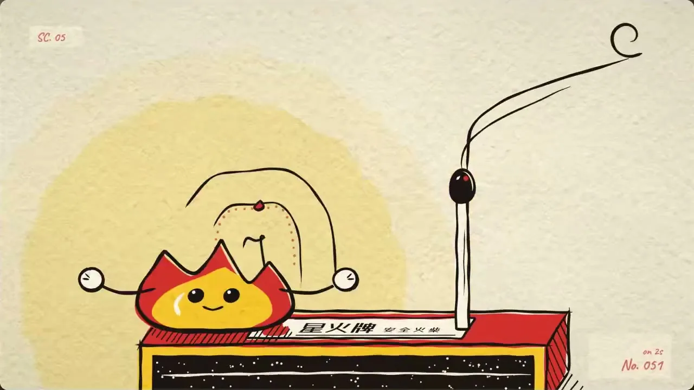
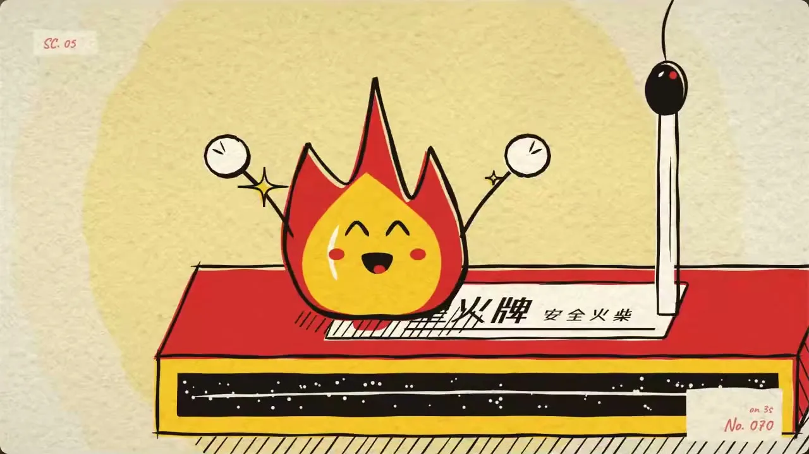
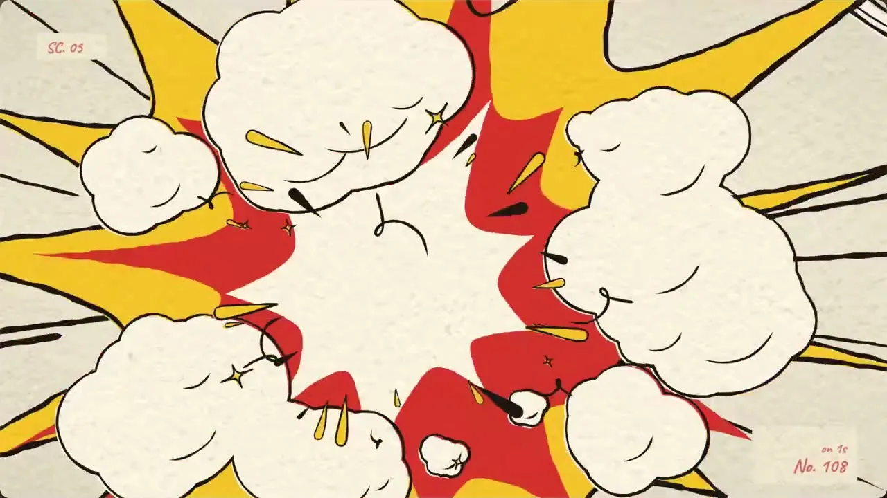

# 01 · 逐帧手绘 / Frame-by-Frame Hand-Drawn

**招牌(一眼认出的特征)**

- 沸腾墨线:墨黑粗描边粗细不匀,一拍二重绘,每换一张线条整体轻颤,像一张张画在动画纸上。
- 限色纸本平涂:暖米白纸纹底上只有一主一辅两种高饱和暖色加墨黑,主体背后垫一团淡柔圆光晕。
- 漫画冲击帧:动作靠挤压拉伸与速度线,最强节拍插满屏星爆、底色硬闪。

  

## 中文提示词

【风格】
逐帧手绘复古漫画动画。
① 造型与材质:墨黑粗描边粗细不匀,一拍二重绘,线条每张都在轻颤沸腾;任何主体都画成圆胖夸张的平涂,暗面用手绘排线;整幅像一张动画纸,角落带手写场号与张数小签。
② 配色与背景:暖米白纸纹铺满画面;只用一主一辅两种饱和暖色加墨黑,纯色平涂;主体背后垫一团淡柔圆光晕。
③ 运动规律:默认一拍二,快动作一拍一;动作靠挤压拉伸、残影、速度线;最猛一拍砸满屏漫画星爆,底色在纸、墨、主色间硬闪;景别靠硬切转换。

【导演】
画面里出现什么、怎么编排,全部由内容决定;风格只决定它们怎么被画出来、怎么动。
这是一支大师级的动态设计短片,出自顶级动效导演之手。
- 读懂内容,找到一个贯穿全片的视觉构思:让一个主角从头演到尾,画面在它身上一路生长、变化,像一个连续的长镜头。
- 让画面自己把事讲清楚:观众只看画面的变化,就能看懂每一步。
- 每个动作都在表演:有预备、发力、超调和回落,快慢分明;节奏像一首曲子,有起承转合,最大的动作落在高潮。
- 每一帧都经得起暂停:构图饱满,尺度对比大胆,焦点明确,随手截一帧就是一张好海报。
- 第一帧就抓人,结尾是一个精心设计的定格。

内容:{在这里写你的内容}

## English Prompt

[Style]
Frame-by-frame hand-drawn retro comic animation.
1) Form & material: thick ink-black outlines of uneven weight, redrawn on twos so the lines boil and tremble on every drawing; render any subject as chubby, exaggerated flat shapes, shadows done with hand hatching; the whole frame reads as a sheet of animation paper, with small handwritten scene and drawing-number tags in the corners.
2) Color & ground: warm off-white paper grain covers the entire frame; only one main and one secondary saturated warm color plus ink black, in pure flat fills; a pale, soft-edged round glow sits behind the subject.
3) Motion: on twos by default, fast actions on ones; actions are sold with squash and stretch, smears and speed lines; the biggest hit lands as a full-screen comic starburst, the ground flashing hard between paper, ink black and the main color; shot sizes change with hard cuts.

[Direction]
What appears on screen and how it is arranged is decided entirely by the content; the style only decides how things are drawn and how they move.
This is a master-level motion design short, made by a top motion director.
- Understand the content and find one visual idea that carries the whole piece: let a single hero perform from start to finish, the picture growing and transforming around it like one continuous long take.
- Let the pictures tell the story: a viewer who only watches how the images change can follow every step.
- Every move is a performance: anticipation, drive, overshoot and settle, with clear contrast between fast and slow; the rhythm flows like a piece of music, with a beginning, build, turn and resolution, and the biggest move lands at the climax.
- Every frame holds up when paused: full compositions, bold contrasts of scale, a clear focal point; any frame grabbed at random makes a good poster.
- The first frame grabs attention, and the ending is a carefully designed final hold.

Content: {your content here}
