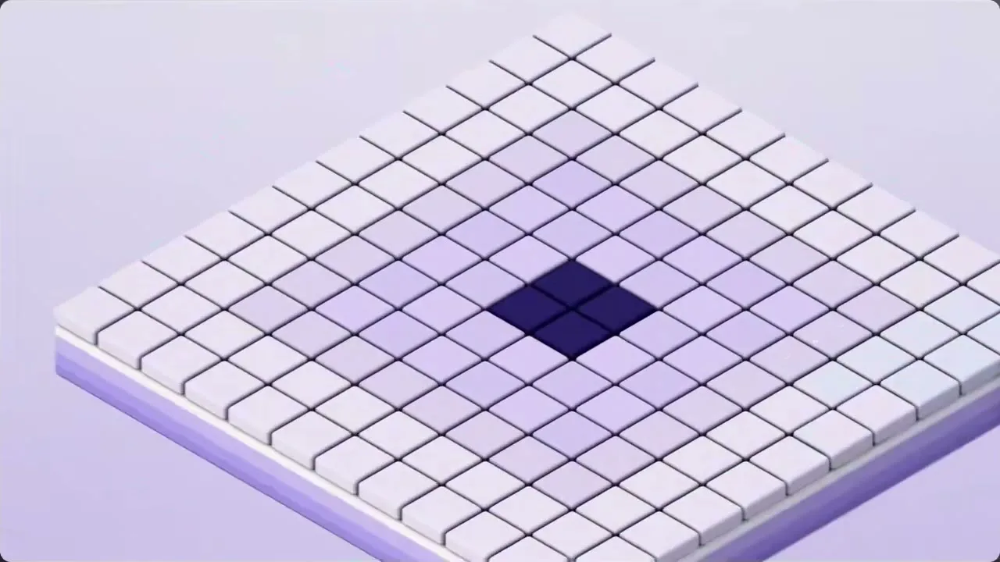
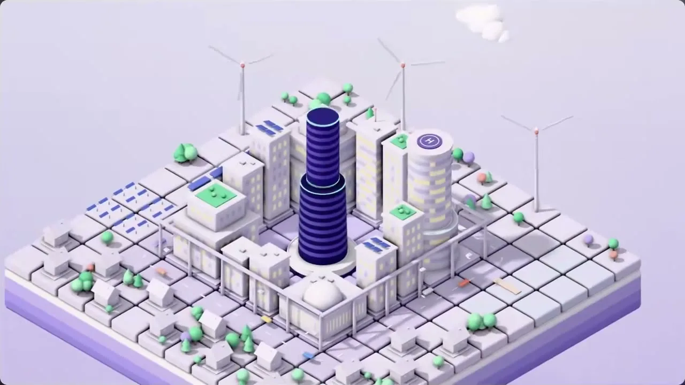
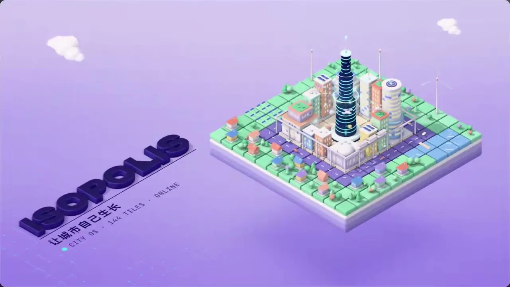

# 02 · 等轴2.5D / Isometric 2.5D

**招牌(一眼认出的特征)**

- 锁死的正交等轴俯视：无透视、平行线不汇聚，镜头只平移推拉不改角度
- 万物按同一方格单元拆成圆角哑光黏土小块，顶亮侧暗、贴地软影，浸在浅薰衣草紫柔雾里，深靛小块压重心
- 一格一格错峰落位/拔高，短促缓出带轻回弹，连续顺滑带运动模糊

  

## 中文提示词

等轴微缩积木风。招牌：锁死正交等轴视角；万物拆成圆角哑光黏土小块；逐格错峰拼出来。
① 造型与材质：无透视，平行线不汇聚；任何主体按同一方格单元切成圆角小块拼成，顶亮侧暗，像桌面微缩模型；哑光黏土，柔和漫射光，贴地软阴影，细节极简。
② 配色与背景：浅薰衣草紫柔雾渐变底；主体以素白和低饱和粉彩为主，同色系明暗分面；一小块深靛压重心。
③ 运动规律：形体逐格错峰落位或拔高，短促缓出带轻回弹，连续顺滑带运动模糊；镜头保持等轴角度，只缓慢平移或推拉。
画面里出现什么、怎么编排,全部由内容决定;风格只决定它们怎么被画出来、怎么动。
内容:{在这里写你的内容}

## English Prompt

Isometric clay-block miniature. Signatures: a locked orthographic isometric view; everything broken into rounded matte clay cubes; it assembles cell by cell, staggered.
1 Form & material: no perspective, parallel lines never converge; any subject is cut into rounded blocks on one shared square unit, bright tops and darker sides, like a tabletop miniature; matte clay surface, soft diffuse light, soft contact shadows, minimal detail.
2 Color & background: a soft lavender haze background that deepens toward the bottom; subjects mostly off-white and low-saturation pastels, faces separated by lighter/darker tones of the same hue; one small deep-indigo mass anchors the eye.
3 Motion: forms drop into place or rise cell by cell in a staggered cascade, quick ease-out with a slight bounce, continuous and smooth with motion blur; the camera keeps the isometric angle and only slowly pans or dollies.
What appears on screen and how it is arranged is decided entirely by the content; the style only decides how it is drawn and how it moves.
Content: {your content here}
