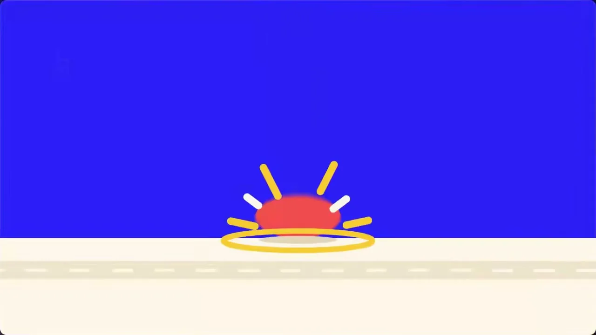
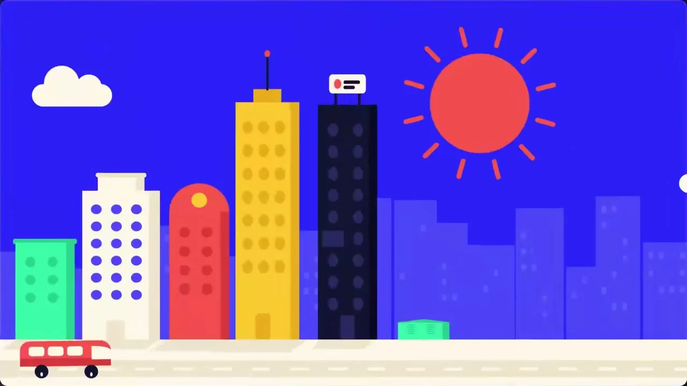
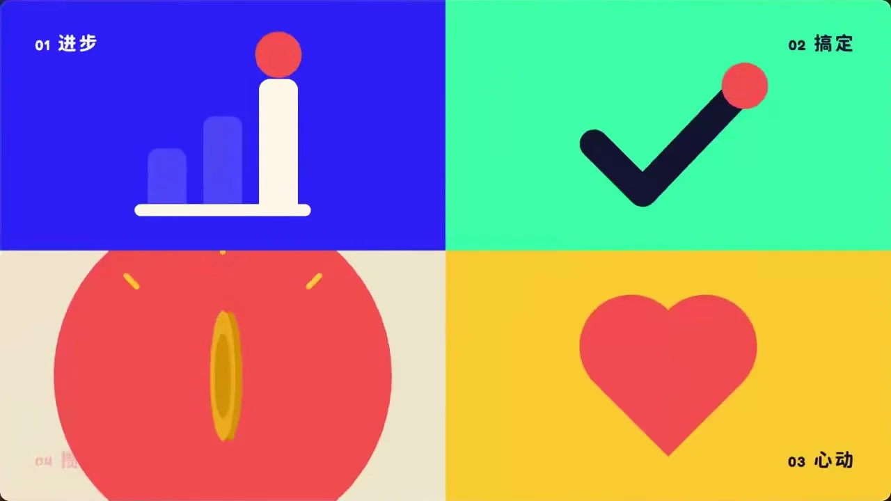

# 03 · 扁平矢量 / Flat Vector

**招牌(一眼认出的特征)**

- 色相即招牌：电光蓝大面积铺底，珊瑚红、薄荷绿、明黄、奶油白作纯色块，深藏青压暗部
- 一颗珊瑚红实心圆点在画面间穿针引线，换场时膨胀成满屏圆形色面擦入下一画面
- 橡皮般的落位：下落拉长、触地压扁、过冲回弹，落点迸出放射短线与扁椭圆涟漪

  

## 中文提示词

【风格】
电光蓝弹跳扁平风。
① 造型与材质:主体拆成圆、圆角矩形、胶囊的纯色块,干净平涂;细节用同色小圆点阵列,纵深靠浅一档同色剪影叠层;一颗珊瑚红圆点串起整个画面。
② 配色与背景:电光蓝纯色铺底占大半,珊瑚红只点焦点,薄荷绿、明黄、奶油白作次要块面,深藏青压暗部。
③ 运动规律:下落拉长、触地压扁、过冲回弹,落点迸放射短线和涟漪;元素错开弹入;快移带方向模糊;换场由红点胀成满屏圆擦入。

【导演】
画面里出现什么、怎么编排,全部由内容决定;风格只决定它们怎么被画出来、怎么动。
这是一支大师级的动态设计短片,出自顶级动效导演之手。
- 读懂内容,找到一个贯穿全片的视觉构思:让一个主角从头演到尾,画面在它身上一路生长、变化,像一个连续的长镜头。
- 让画面自己把事讲清楚:观众只看画面的变化,就能看懂每一步。
- 每个动作都在表演:有预备、发力、超调和回落,快慢分明;节奏像一首曲子,有起承转合,最大的动作落在高潮。
- 每一帧都经得起暂停:构图饱满,尺度对比大胆,焦点明确,随手截一帧就是一张好海报。
- 第一帧就抓人,结尾是一个精心设计的定格。

内容:{在这里写你的内容}

## English Prompt

[Style]
Electric-blue bouncy flat style.
1) Form & material: break any subject into clean solid blocks built from circles, rounded rectangles and pills, in pure flat color; detail is arrays of small same-color dots, depth is layered silhouettes one shade lighter in the same hue; one coral-red dot threads the whole piece together.
2) Color & ground: a flat electric-blue field covers most of the frame, coral red is reserved for the focal point, mint, sunflower yellow and cream share secondary blocks, deep navy carries the darks.
3) Motion: falling elements stretch, squash on contact and overshoot back, the impact point bursts short radial ticks and a ripple; groups pop in with staggered timing; fast moves carry directional motion blur; scene changes happen as the red dot swells into a full-screen circle that wipes into the next frame.

[Direction]
What appears on screen and how it is arranged is decided entirely by the content; the style only decides how things are drawn and how they move.
This is a master-level motion design short, made by a top motion director.
- Understand the content and find one visual idea that carries the whole piece: let a single hero perform from start to finish, the picture growing and transforming around it like one continuous long take.
- Let the pictures tell the story: a viewer who only watches how the images change can follow every step.
- Every move is a performance: anticipation, drive, overshoot and settle, with clear contrast between fast and slow; the rhythm flows like a piece of music, with a beginning, build, turn and resolution, and the biggest move lands at the climax.
- Every frame holds up when paused: full compositions, bold contrasts of scale, a clear focal point; any frame grabbed at random makes a good poster.
- The first frame grabs attention, and the ending is a carefully designed final hold.

Content: {your content here}
