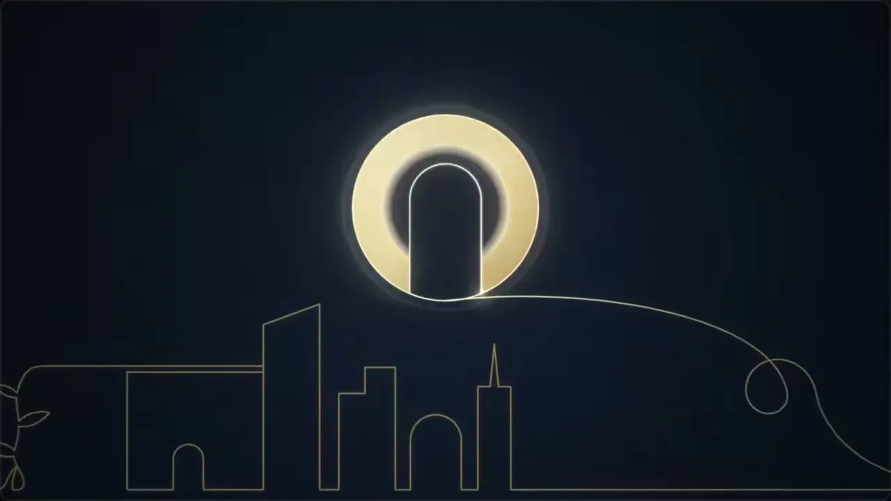
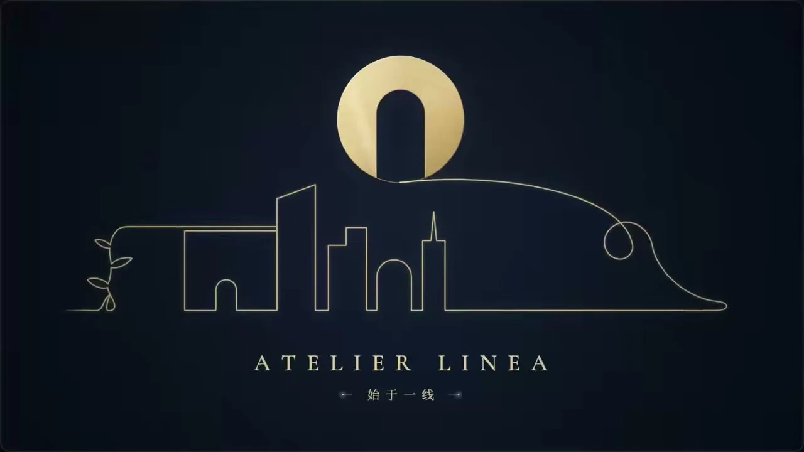

# 04 · 线条动画 / Single-Line Art

**招牌(一眼认出的特征)**

- 一笔画:所有东西都由同一根不断的细金线连续勾出,物与物之间也被这根线串起来,全片几乎只有线、不铺块面
- 活的笔尖:线头带白热光点不停前进、刚画的一段更亮,镜头平移跟着笔尖走,任何一帧都看得出「线正在被画」
- 深海军蓝暗角底 + 低饱和暖金线 + 大留白;唯一的实心面是某个闭合形被瞬间灌满金色并荡出光圈

  

## 中文提示词

单线金描风:一根不断的金线一笔画出一切,笔尖拖着白热光点,暗蓝底上只有金线。
① 造型与材质:任何物体只勾外形,由同一根细线连续画成,物与物之间也被这根线串起;不提笔、不铺块面,只在要强调处让一个闭合形填成实金。
② 配色与背景:深海军蓝近黑底,四角压暗;线是低饱和暖金,刚画的一段偏白发亮;大半留空。
③ 运动规律:笔尖持续前进,线永远在被画出来,折角略收一拍;镜头平移跟住笔尖;线一闭合,金色由外向内瞬间灌满并荡出一圈光;要看全貌时才缓缓拉远。
画面里出现什么、怎么编排,全部由内容决定;风格只决定它们怎么被画出来、怎么动。
内容:{在这里写你的内容}

## English Prompt

Single-Line Gold style: one unbroken gold line draws everything in a single stroke, its tip trailing a white-hot spark; on a dark navy ground there is nothing but gold line.
① Form & material: every subject is outline only, drawn by the same thin continuous line, which also travels from one subject to the next to join them; never lift the pen or split into separate strokes. No filled areas, except one closed shape at a moment of emphasis that fills solid gold with a soft halo.
② Color & background: deep navy, near-black ground, darkened toward the corners; the line is a desaturated warm gold, with the freshly drawn stretch glowing whitish before settling back to gold; most of the frame stays empty.
③ Motion: the tip keeps moving, so the line always reads as being drawn right now, easing for a beat at sharp corners; the camera pans to stay with the tip; when the line closes a shape, gold floods in from the edge inward in an instant and a ring of light ripples out; the camera slowly pulls back only when the whole picture needs to be seen.
What appears on screen and how it is arranged is decided entirely by the content; the style only decides how things are drawn and how they move.
Content: {your content here}
