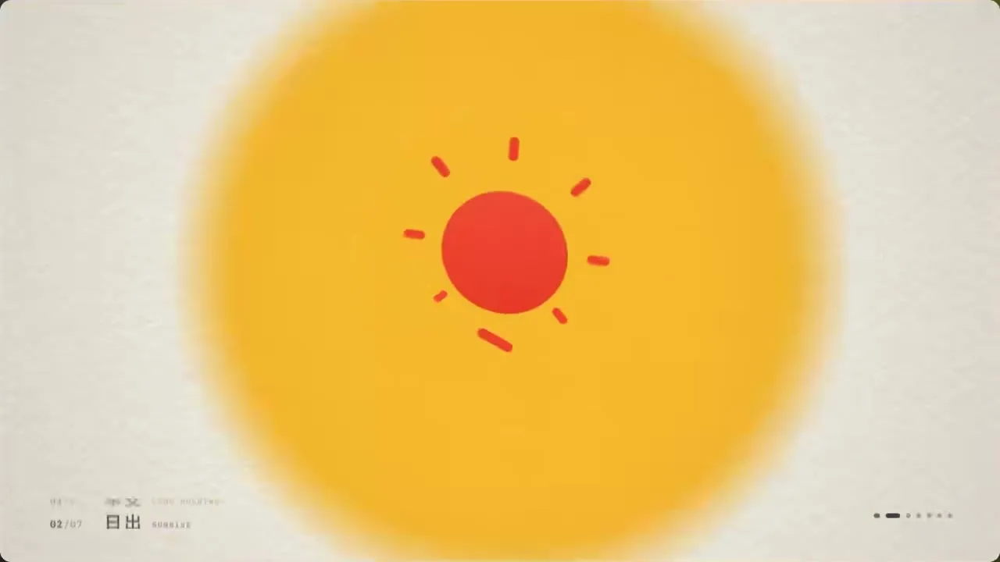

# 06 · 形变动画 / Shape Morph

> 一个形状连续变身,底色随形翻页

  

## 中文提示词

风格:单一形状连续变形串起全片,扁平图标极简。
画面:#F3EFE4 纸白、#15141A 墨黑、#E8422C 红、#F4BF35 黄、#262ED7 钴蓝大色块;居中单主体,实心填充+一道斜向浅色折面;全屏纸纹+轻暗角。
字体:如需文字:粗几何无衬线;角落小号等宽章节号,换段上下滚动替换。
动效:30fps 全帧不抽帧;每形停 1–1.5s,形变 8–12 帧 ease-in-out,落地挤压回弹约 10%;快移带方向模糊;换段时新底色从主体中心以软边圆 5–8 帧加速扩满屏;形内换色用斜向擦除。
实现:flubber 插值 SVG path d;底色 clip-path circle+blur。
不要:交叉淡化换形;多主体并排;线稿描边;渐变光。
内容:{在这里写你的内容}

## English Prompt

Style: one shape continuously morphs to carry the whole piece; flat, iconic minimalism.
Visual: #F3EFE4 paper white, #15141A ink, #E8422C red, #F4BF35 yellow, #262ED7 cobalt as big flat fields; one centered subject, solid fill plus one diagonal lighter fold facet; full-frame paper grain, light vignette.
Type (if needed): bold geometric sans; small mono chapter index in a corner, rolls vertically on section change.
Motion: 30fps, no stepping; hold each form 1–1.5s, morph in 8–12 frames ease-in-out, ~10% squash-rebound on landing; directional blur on fast moves; on section change the new background grows from the subject's center as a soft-edged circle filling the screen in 5–8 accelerating frames; recolor inside the shape with a diagonal wipe.
Build: flubber-interpolated SVG path d; background via clip-path circle + blur.
Avoid: crossfading between shapes; multiple subjects side by side; outline line-art; gradient glows.
Content: {your content here}
