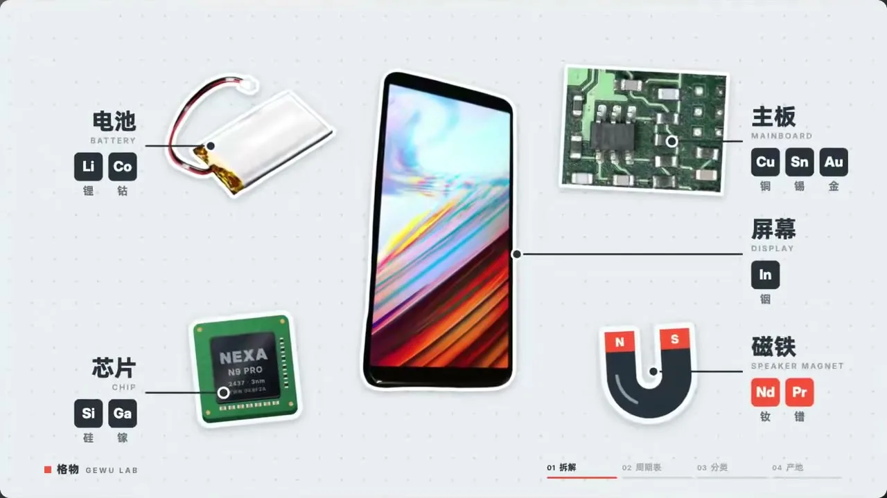
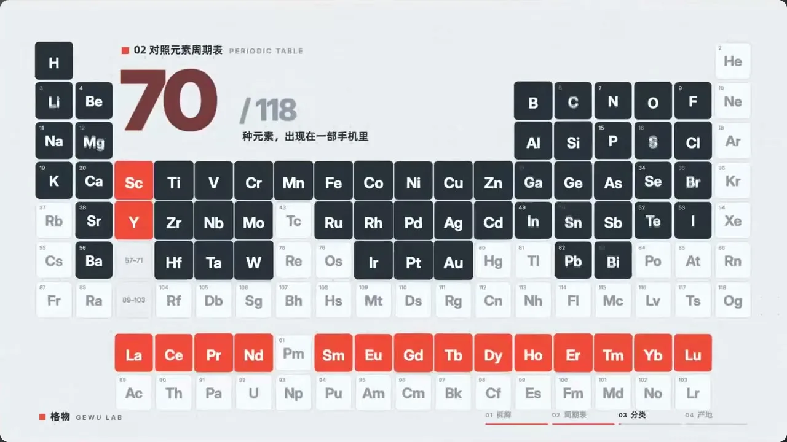

# 07 · 贴纸风科普 / Sticker Explainer

**招牌(一眼认出的特征)**

- 实物一律抠成照片贴纸:粗白边加柔和短投影,略带倾斜
- 抽象信息拆成大小统一的深色圆角小方块,同一批方块会飞起重排成新结构
- 不切不淡,换段是整画面急推急摇,带强烈方向运动模糊,落定后近乎静止

  

## 中文提示词

【风格】
实物贴纸信息图。
① 造型与材质:任何主体都抠成真实照片贴纸,包粗白边、落短软投影,微微歪斜;数量与类别拆成大小一致的深色圆角方块,一块一单位,靠堆叠表达多少与归属。
② 配色与背景:高明度冷灰底,铺极淡点阵;近黑画方块与字;一个高饱和强调色只点重点,其余是素净的灰阶。
③ 运动规律:元素弹入带微过冲;方块错峰飞起、边飞边歪、落成新排列;换段靠整屏急推急摇完成,带强方向运动模糊,落定后稳稳停住。

【导演】
画面里出现什么、怎么编排,全部由内容决定;风格只决定它们怎么被画出来、怎么动。
这是一支大师级的动态设计短片,出自顶级动效导演之手。
- 读懂内容,找到一个贯穿全片的视觉构思:让一个主角从头演到尾,画面在它身上一路生长、变化,像一个连续的长镜头。
- 让画面自己把事讲清楚:观众只看画面的变化,就能看懂每一步。
- 每个动作都在表演:有预备、发力、超调和回落,快慢分明;节奏像一首曲子,有起承转合,最大的动作落在高潮。
- 每一帧都经得起暂停:构图饱满,尺度对比大胆,焦点明确,随手截一帧就是一张好海报。
- 第一帧就抓人,结尾是一个精心设计的定格。

内容:{在这里写你的内容}

## English Prompt

[Style]
Photo-sticker infographic.
1) Form & material: cut any subject out as a real photo sticker, wrapped in a thick white border with a short soft shadow, slightly tilted; break quantities and categories into identical dark rounded tiles, one tile per unit, so stacking shows how many and what belongs where.
2) Color & ground: bright cool-gray ground with a very faint dot grid; near-black for tiles and type; exactly one saturated accent, only on key points, everything else in quiet grays.
3) Motion: elements pop in with slight overshoot; tiles lift off in a stagger, tilt in flight and land in a new arrangement; sections change through a fast whole-frame whip or push with strong directional motion blur, then settle firmly in place.

[Direction]
What appears on screen and how it is arranged is decided entirely by the content; the style only decides how things are drawn and how they move.
This is a master-level motion design short, made by a top motion director.
- Understand the content and find one visual idea that carries the whole piece: let a single hero perform from start to finish, the picture growing and transforming around it like one continuous long take.
- Let the pictures tell the story: a viewer who only watches how the images change can follow every step.
- Every move is a performance: anticipation, drive, overshoot and settle, with clear contrast between fast and slow; the rhythm flows like a piece of music, with a beginning, build, turn and resolution, and the biggest move lands at the climax.
- Every frame holds up when paused: full compositions, bold contrasts of scale, a clear focal point; any frame grabbed at random makes a good poster.
- The first frame grabs attention, and the ending is a carefully designed final hold.

Content: {your content here}
