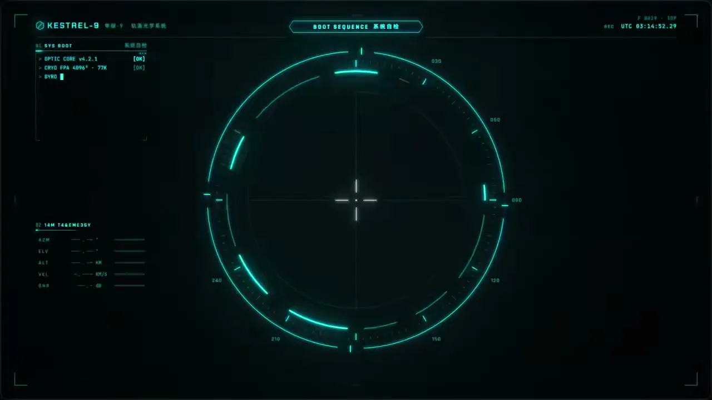
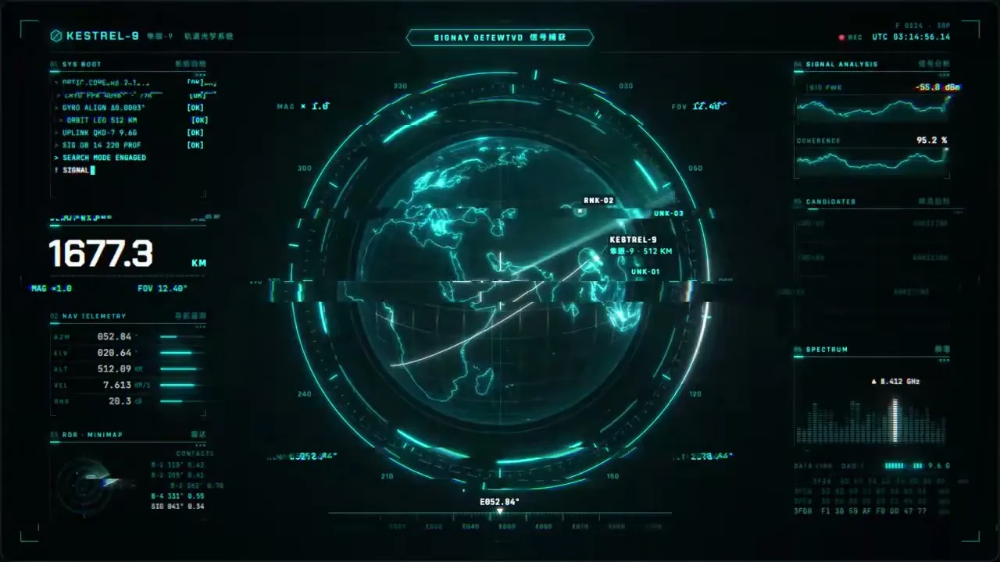
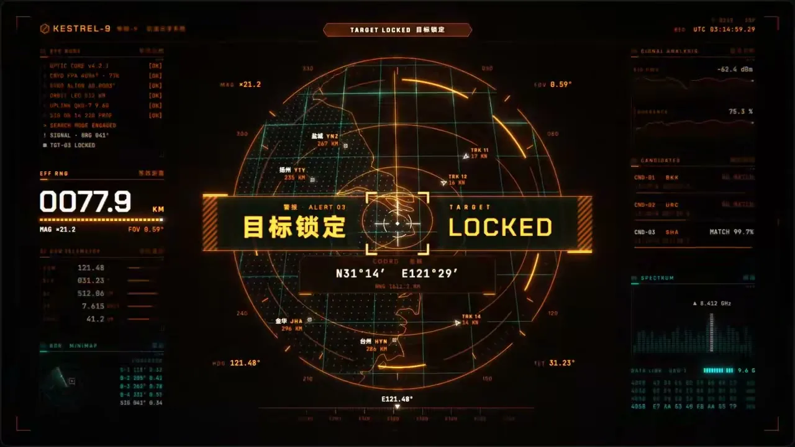

# 08 · 赛博朋克HUD / Cyberpunk HUD (FUI)

**招牌(一眼认出的特征)**

- 任何主体都被同心分段刻度圆环加十字准星锁在画面中央,像正被瞄准测量
- 主体四周环绕带角括号的细线框读数模块,其中一个大号数字始终在跳动
- 近黑底上只有单一青色发光细线,到关键状态整屏换成琥珀橙

  

## 中文提示词

【风格】
FUI 瞄准仪表风。
① 造型与材质:全用发光细线、刻度、点线勾出;主体成线框轮廓,被分段刻度圆环加准星锁在画面中央,像正在被测量;四周细线框读数带角括号,一个大数字始终在跳。
② 配色与背景:近黑底带冷暗角;单一青色靠亮度分主次,近白点焦点;关键时刻整屏转成琥珀色警示。
③ 运动规律:入场如开机,亮线拉开成准星,圆弧沿刻度描出,字逐行打出;圆环缓转、扫描掠过、数字滚动;转态先闪切片错位再换色。

【导演】
画面里出现什么、怎么编排,全部由内容决定;风格只决定它们怎么被画出来、怎么动。
这是一支大师级的动态设计短片,出自顶级动效导演之手。
- 读懂内容,找到一个贯穿全片的视觉构思:让一个主角从头演到尾,画面在它身上一路生长、变化,像一个连续的长镜头。
- 让画面自己把事讲清楚:观众只看画面的变化,就能看懂每一步。
- 每个动作都在表演:有预备、发力、超调和回落,快慢分明;节奏像一首曲子,有起承转合,最大的动作落在高潮。
- 每一帧都经得起暂停:构图饱满,尺度对比大胆,焦点明确,随手截一帧就是一张好海报。
- 第一帧就抓人,结尾是一个精心设计的定格。

内容:{在这里写你的内容}

## English Prompt

[Style]
FUI targeting-instrument style.
1) Form & material: everything drawn in glowing hairlines, ticks and dotted strokes; the subject becomes a wireframe outline, locked dead-center by segmented tick rings and a crosshair, as if being measured; hairline-framed readouts with corner brackets surround it, one big number always ticking.
2) Color & ground: near-black with a cool vignette; a single cyan ranked by brightness, near-white for focus; at the critical moment the whole screen turns amber as an alert.
3) Motion: entrances feel like a device powering on — a bright line opens into the crosshair, arcs draw along their ticks, text types out line by line; rings turn slowly, scans sweep, numbers roll; a state change opens with a quick slice-offset glitch, then the color switches.

[Direction]
What appears on screen and how it is arranged is decided entirely by the content; the style only decides how things are drawn and how they move.
This is a master-level motion design short, made by a top motion director.
- Understand the content and find one visual idea that carries the whole piece: let a single hero perform from start to finish, the picture growing and transforming around it like one continuous long take.
- Let the pictures tell the story: a viewer who only watches how the images change can follow every step.
- Every move is a performance: anticipation, drive, overshoot and settle, with clear contrast between fast and slow; the rhythm flows like a piece of music, with a beginning, build, turn and resolution, and the biggest move lands at the climax.
- Every frame holds up when paused: full compositions, bold contrasts of scale, a clear focal point; any frame grabbed at random makes a good poster.
- The first frame grabs attention, and the ending is a carefully designed final hold.

Content: {your content here}
