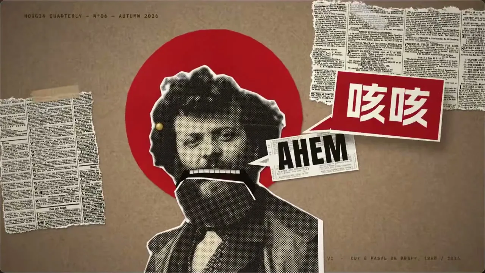
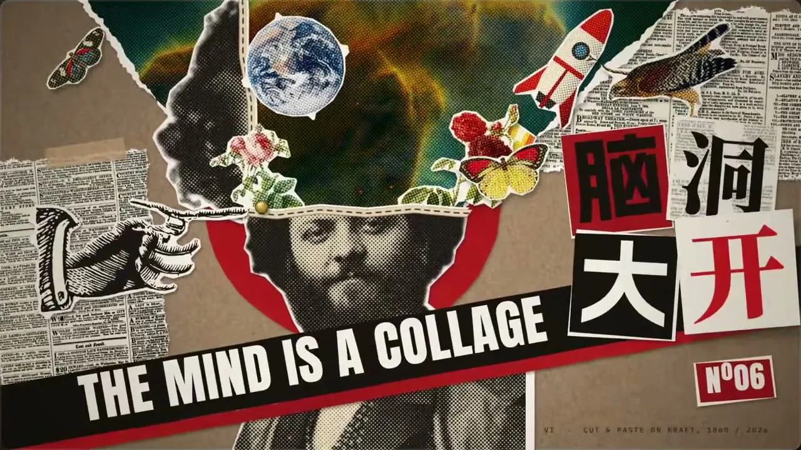
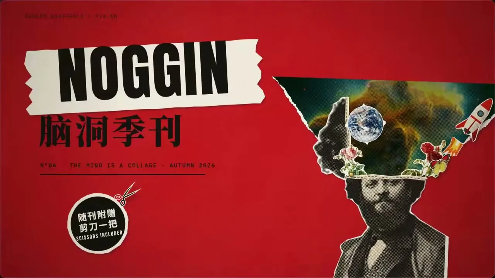

# 09 · 拼贴剪贴 / Collage Cut-Out

**招牌(一眼认出的特征)**

- 万物皆剪片:任何主体都做成从印刷品上剪下的纸片——照片压成粗网点黑白,外缘留不规整白边或撕毛边,带薄投影、略歪斜地叠在牛皮纸上。
- 牛皮纸底 + 报纸米白/油墨黑的高反差灰阶,唯一的强色是一种印刷红,以整块平涂纸片出现。
- 一拍二到一拍三的逐格步进:纸片被一下一下拍上去,冲大、回弹、定死;换场靠剪开、撕开、掀起纸层。

  

## 中文提示词

【风格】
剪报拼贴风。
① 造型与材质:任何主体都做成剪下的实物纸片——照片转粗网点黑白灰阶,插图取老版画线刻;外缘留不规整白边或撕成毛边,带薄投影、略歪斜,可用胶带固定;纸片层层压叠出纵深。
② 配色与背景:牛皮纸底,带纤维与暗角;主体为报纸米白与油墨黑的高反差灰阶,彩图也压成褪色网点;唯一强色是一种印刷红,以整块平涂纸片出现。
③ 运动规律:一拍二到一拍三逐格步进;纸片被一下拍上,冲大、回弹、定死;揭示与换场靠剪开、撕开、掀起纸层。

【导演】
画面里出现什么、怎么编排,全部由内容决定;风格只决定它们怎么被画出来、怎么动。
这是一支大师级的动态设计短片,出自顶级动效导演之手。
- 读懂内容,找到一个贯穿全片的视觉构思:让一个主角从头演到尾,画面在它身上一路生长、变化,像一个连续的长镜头。
- 让画面自己把事讲清楚:观众只看画面的变化,就能看懂每一步。
- 每个动作都在表演:有预备、发力、超调和回落,快慢分明;节奏像一首曲子,有起承转合,最大的动作落在高潮。
- 每一帧都经得起暂停:构图饱满,尺度对比大胆,焦点明确,随手截一帧就是一张好海报。
- 第一帧就抓人,结尾是一个精心设计的定格。

内容:{在这里写你的内容}

## English Prompt

[Style]
Cut-and-paste newsprint collage.
1) Form & material: treat any subject as a physical paper cutting — photos become coarse halftone black-and-white greyscale, drawings look like old engraved line art; each piece has a ragged white cut border or a torn fibrous edge, a thin drop shadow and a slight tilt, optionally taped down; scraps pile on top of each other to build depth.
2) Color & ground: fibrous kraft paper with a vignette; subjects in high-contrast newsprint cream and ink black, any color imagery pressed into faded halftone; the single strong color is one printing red, appearing as solid flat paper pieces.
3) Motion: stepped animation on twos to threes; pieces land as if slapped down by hand — overshoot, bounce back, then lock dead still; reveals and scene changes happen by cutting, tearing or peeling back a paper layer.

[Direction]
What appears on screen and how it is arranged is decided entirely by the content; the style only decides how things are drawn and how they move.
This is a master-level motion design short, made by a top motion director.
- Understand the content and find one visual idea that carries the whole piece: let a single hero perform from start to finish, the picture growing and transforming around it like one continuous long take.
- Let the pictures tell the story: a viewer who only watches how the images change can follow every step.
- Every move is a performance: anticipation, drive, overshoot and settle, with clear contrast between fast and slow; the rhythm flows like a piece of music, with a beginning, build, turn and resolution, and the biggest move lands at the climax.
- Every frame holds up when paused: full compositions, bold contrasts of scale, a clear focal point; any frame grabbed at random makes a good poster.
- The first frame grabs attention, and the ending is a carefully designed final hold.

Content: {your content here}
