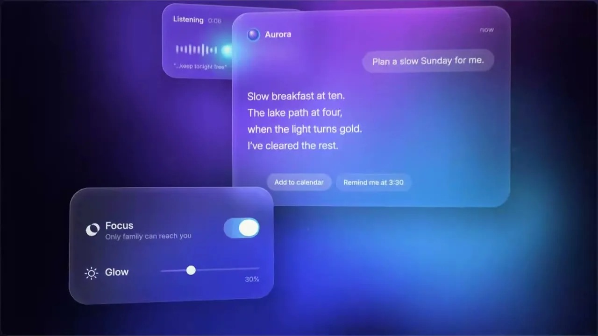
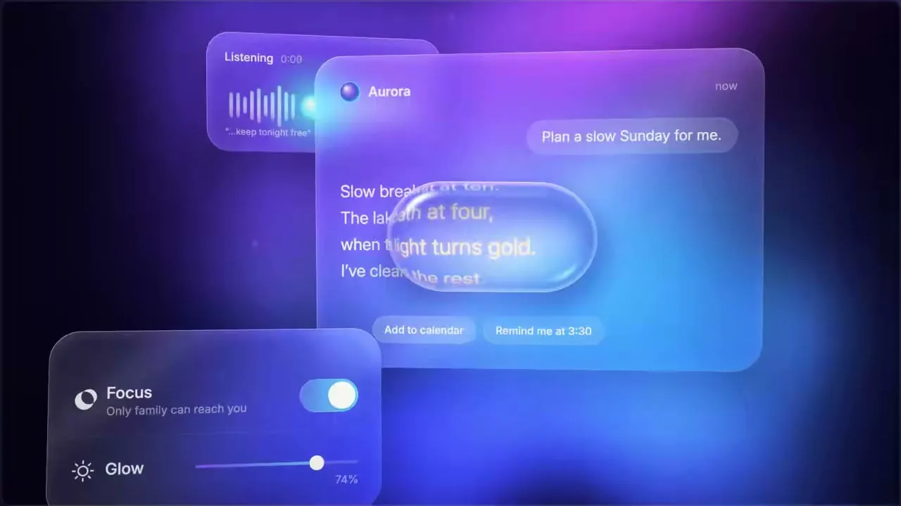
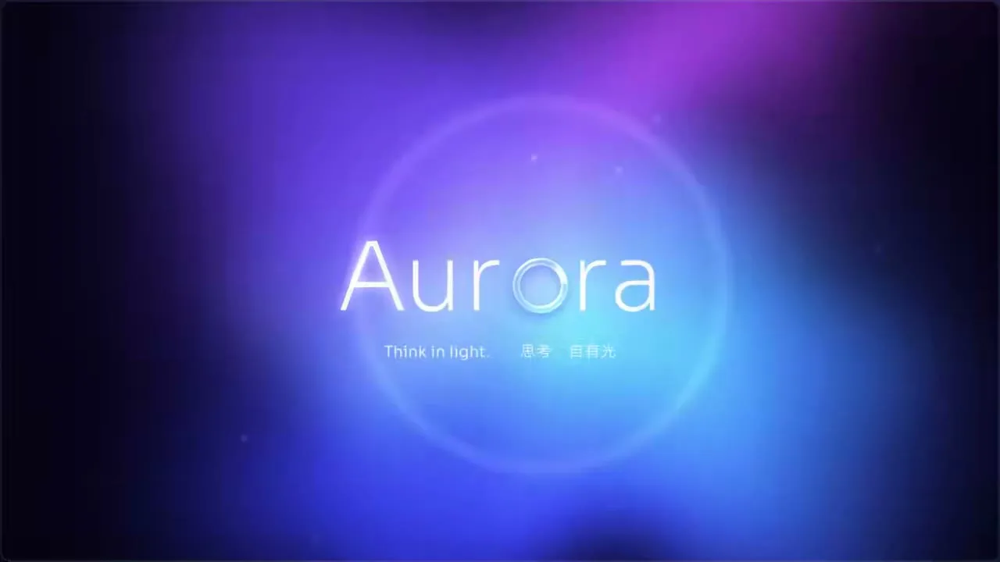

# 10 · 弥散渐变玻璃拟态 / Aurora Glassmorphism

**招牌(一眼认出的特征)**

- 暗场极光:近黑底上几团极大柔焦光,蓝为主、紫青为辅,彼此晕染无边界
- 万物皆磨砂玻璃:任何主体都是大圆角半透明玻璃片,背光晕入其中,轮廓一线白亮高光,前后错层
- 液态玻璃透镜:一枚透明厚玻璃缓慢滑过,把底下的形与字鼓起放大、边缘泛彩虹色散

  

## 中文提示词

「极光玻璃」:暗场蓝紫青极光,万物皆磨砂玻璃,液态透镜滑过放大扭弯。
① 造型与材质:任何主体都是大圆角磨砂玻璃片,背光晕染进片内,轮廓一线白亮高光;多片前后错层、微透视倾斜。透明厚玻璃透镜经过处,形与字鼓起放大,边缘泛彩虹色散。
② 配色与背景:近黑冷底压暗角;几团巨大柔焦光互相晕染,蓝主、紫青辅,无色带;前景只用白与半透明白。
③ 运动规律:全程顺滑;背景光如极光缓缓变形;玻璃片轻浮漂移带层间视差;元素由虚到实浮现,失焦后退离场;透镜缓慢游走。
画面里出现什么、怎么编排,全部由内容决定;风格只决定它们怎么被画出来、怎么动。
内容:{在这里写你的内容}

## English Prompt

"Aurora Glass" style, three signatures: a blue-violet-cyan aurora glowing in a dark void; every subject rendered as translucent frosted glass; a liquid-glass lens that glides over things, magnifying and bending whatever lies beneath.
1 Form & material: turn any subject into large-radius frosted glass panes; the light behind them diffuses and tints into the pane, leaving only a hairline bright highlight on the outline. Panes sit in staggered depth with a slight perspective tilt. The lens is thick clear glass: shapes and text under it bulge and enlarge, edges fringed with rainbow dispersion.
2 Color & background: near-black cool ground with darkened corners; a few huge soft-focus glows bleed into each other, blue dominant, violet and cyan secondary, no banding. Foreground uses only white and translucent white, never solid color.
3 Motion: smooth and continuous throughout; background light shifts and morphs slowly like an aurora; panes float gently with parallax between layers; elements resolve from blur to sharp, and exit by defocusing and receding; the lens wanders slowly.
What appears on screen and how it is arranged is decided entirely by the content; the style only decides how it is drawn and how it moves.
Content: {your content here}
