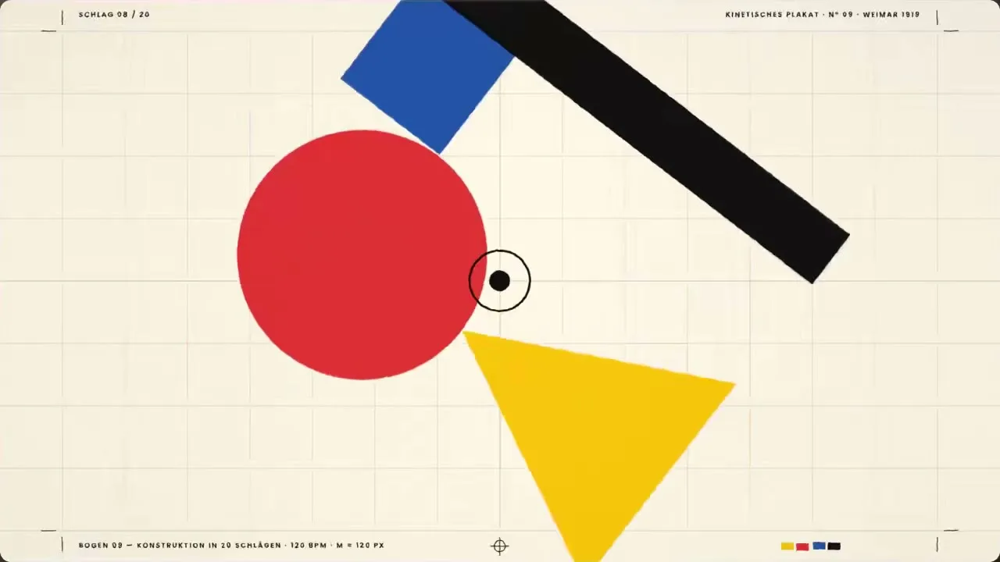
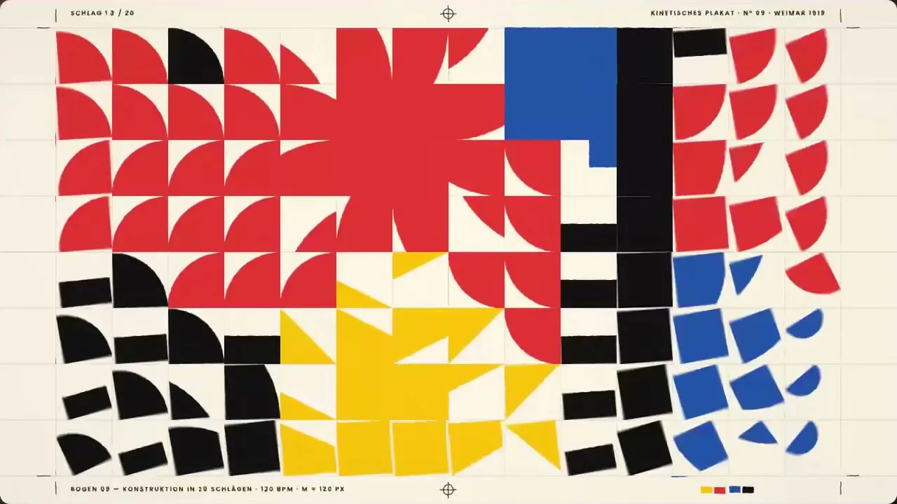
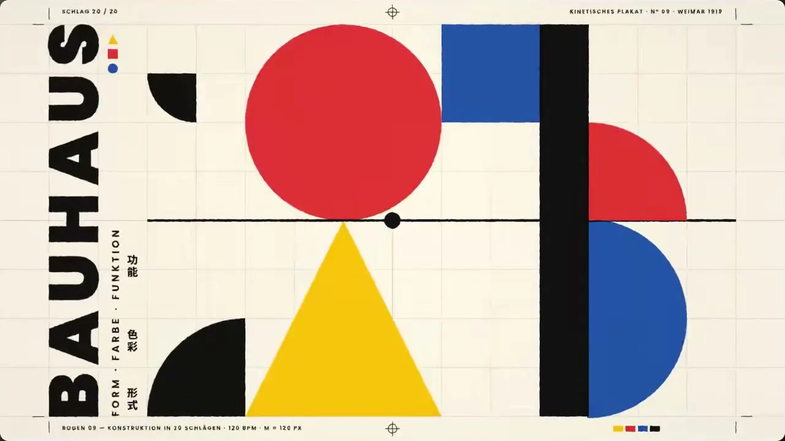

# 11 · 几何构成包豪斯 / Geometric Bauhaus Construction

**招牌(一眼认出的特征)**

- 任何主体都只用平涂的圆、半圆、扇形、方块、三角和粗黑条拼搭,不画具象轮廓
- 红黄蓝三原色加黑、落在暖米白纸上,纯平不混色
- 形之间露着细黑构图线、对位十字和支点圆点,一次一件逐拍搭建、落定不回弹,换段碎成模块块翻转重组

  

## 中文提示词

包豪斯几何构成。招牌:任何主体都用圆、半圆、扇形、方块、三角、粗黑条拼出;只用红黄蓝加黑,落在暖米白纸上;形间露着细黑构图线、对位十字和支点圆点。
① 造型与材质:边缘锐利,纯平涂,无渐变阴影圆角;纸面只带极淡模块网格。
② 配色与背景:三原色高饱和不混色,黑色压重量,米白留白占大半,非对称平衡。
③ 运动规律:踩稳节拍一次只动一件,先现对位十字,再从该点展开、滑入或绕支点转;快起快停带运动模糊,落定不回弹;换段时整幅碎成小格翻转散开再重拼。
画面里出现什么、怎么编排,全部由内容决定;风格只决定它们怎么被画出来、怎么动。
内容:{在这里写你的内容}

## English Prompt

Bauhaus geometric construction. Signature: every subject is broken down and rebuilt only from flat circles, semicircles, quarter-circles, squares, triangles and thick black bars; only the red-yellow-blue primaries plus black, on warm off-white paper; thin black construction lines, registration crosshairs and pivot dots stay visible between the shapes, like a poster caught mid-construction.
1 Form & material: razor-sharp edges, perfectly flat, no gradients, shadows or rounded corners; the paper carries only a very faint module grid.
2 Color & background: saturated primaries that never blend; black adds weight; off-white space dominates; asymmetric balance.
3 Motion: on a steady beat, one piece moves at a time — a crosshair or hairline appears first, then the shape unfolds from that point, slides in, or swings about a pivot; fast start, fast stop, directional motion blur, settles with no bounce; between sections the whole composition shatters into small tiles that flip, scatter and reassemble.
What appears on screen and how it is arranged is decided entirely by the content; the style only decides how it is drawn and how it moves.
Content: {your content here}
