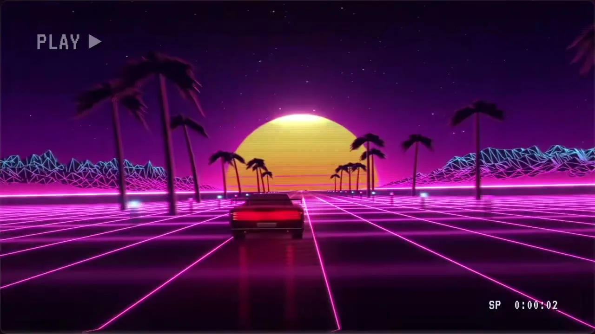
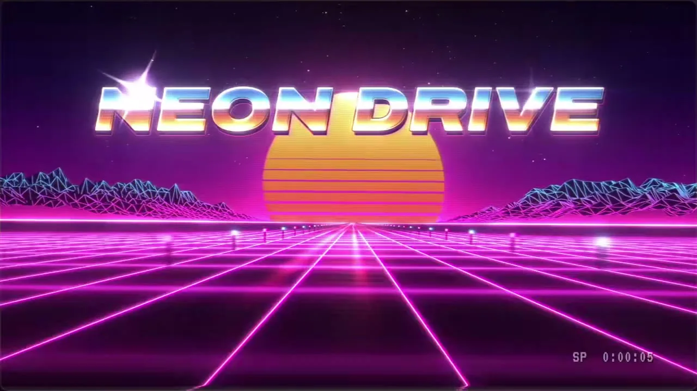
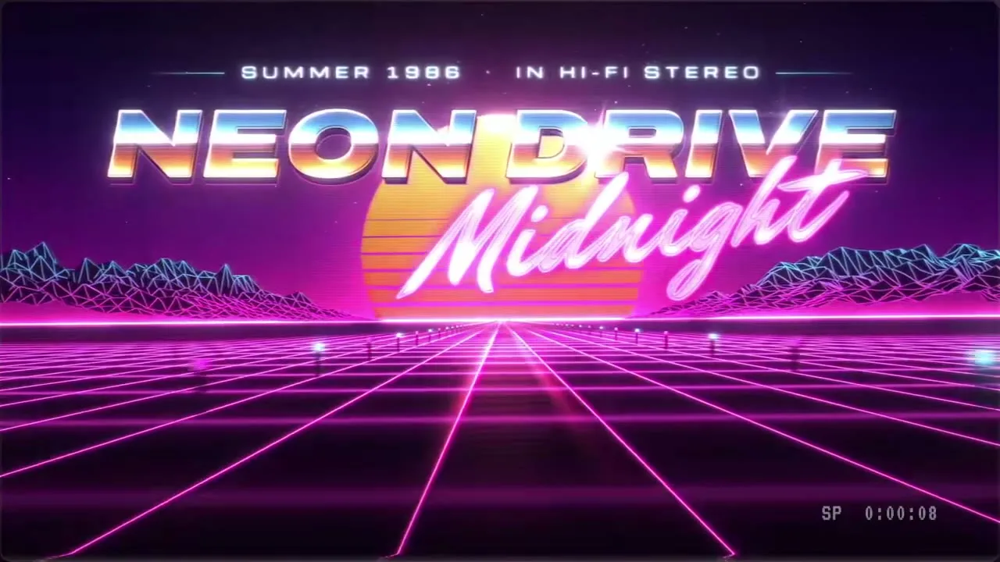

# 12 · 复古Synthwave / Retro Synthwave VHS

**招牌(一眼认出的特征)**

- 暗底霓虹线:近黑深紫底上,任何主体都画成洋红/青的强辉光细线,暖金到珊瑚渐变只作唯一暖点。
- 透视线纵深:空间用朝消失点收束的发光透视线组织,且这些线持续匀速流向镜头。
- 录像带回放:整帧扫描线、色差、噪点、横向撕裂与角落录像屏显,像在看一盘八十年代磁带。

  

## 中文提示词

风格:八十年代合成器浪潮录像带。招牌:暗底霓虹发光线、流向镜头的发光透视线、整帧录像带质感。
① 造型与材质:任何主体都画成强辉光细线框;实体用水平条纹切开的暖渐变,或上冷下暖的镜面铬,高光起星芒。纵深一律由朝远处消失点收束的发光透视线组织。
② 配色与背景:近黑深紫大面积压底,洋红为主、青为辅,暖金到珊瑚渐变是唯一暖点;亮色只占小面积。整帧叠扫描线、色差、细噪点和角落录像屏显。
③ 运动规律:连续平滑不抽帧;透视线匀速流向镜头;元素从镜头前推入急停,伴一闪白光;霓虹闪几下才亮;偶发横向撕裂。
画面里出现什么、怎么编排,全部由内容决定;风格只决定它们怎么被画出来、怎么动。
内容:{在这里写你的内容}

## English Prompt

Style: 80s synthwave on VHS. Signatures: neon glow lines on a dark base, glowing perspective lines streaming toward the camera, full-frame videotape texture.
1) Form & material: draw every subject as thin wireframe with heavy bloom; solids become warm gradients sliced by horizontal stripes, or mirror chrome split cool-top / warm-bottom, with star glints on highlights. Always build depth with glowing perspective lines converging to a distant vanishing point.
2) Color & background: near-black deep purple dominates; magenta leads, cyan supports; a gold-to-coral gradient is the only warm focal point; glowing color stays small in area. Overlay the whole frame with scanlines, chromatic aberration, fine noise and a corner VCR on-screen display.
3) Motion: smooth and continuous, never stepped; perspective lines flow toward the camera at constant speed; elements push in from in front of the lens and stop hard with a white flash; neon flickers a few times before it stays lit; occasional horizontal tape tears.
What appears on screen and how it is arranged is entirely decided by the content; the style only decides how things are drawn and how they move.
Content: {your content here}
