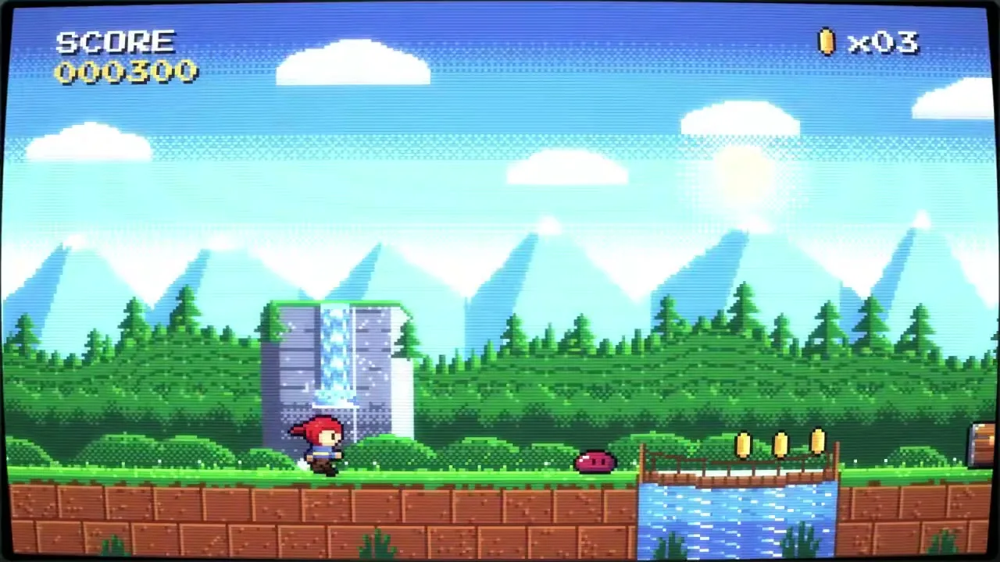
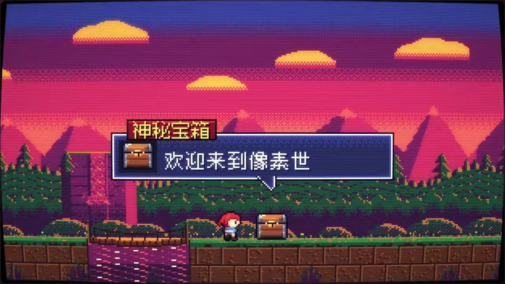
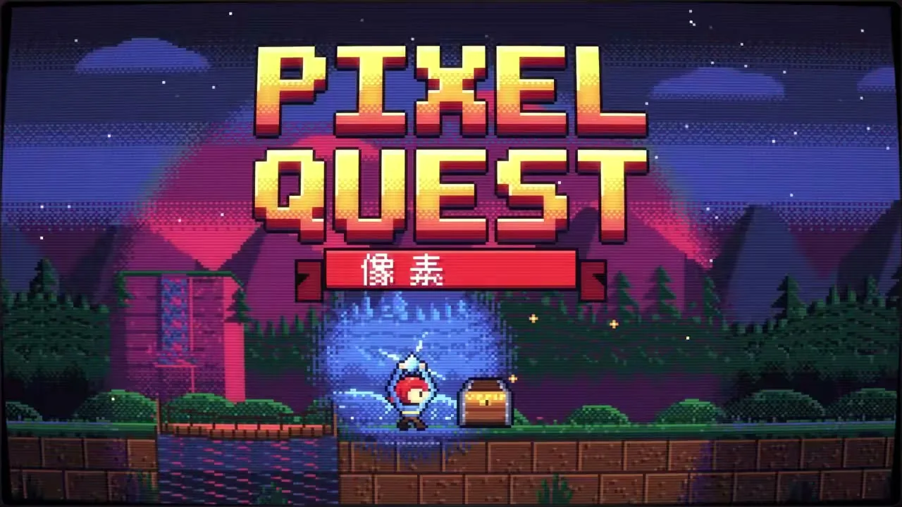

# 13 · 像素风 / 16-bit Pixel Art

**招牌(一眼认出的特征)**

- 粗像素格:任何主体都在粗网格上逐格画、阶梯硬边,光影渐变用棋盘网点分档
- 显像管外罩:整幅画面四边微鼓、圆角暗角、扫描线与亮处泛光
- 整屏换色板:段落转换时整套调色板一次硬切(明亮→暖艳→冷暗),不渐变

  

## 中文提示词

【风格】
16 位像素画,透过 CRT 显像管看。
① 造型与材质:任何主体都在粗网格上逐格画,阶梯硬边;明暗过渡用棋盘网点分档;整幅罩在显像管里:四边微鼓、圆角暗角、横向扫描线、亮处泛光。
② 配色与背景:同屏少色高饱和,每色只分几档明暗;背景与主体同一颗粒尺度,远处压暗。
③ 运动规律:位移按整格跳,动作靠几张姿态轮换;换段落时整套色板一次硬切(明亮→暖艳→冷暗);强调闪一帧白;开场亮线展开,收尾缩成一点熄灭。

【导演】
画面里出现什么、怎么编排,全部由内容决定;风格只决定它们怎么被画出来、怎么动。
这是一支大师级的动态设计短片,出自顶级动效导演之手。
- 读懂内容,找到一个贯穿全片的视觉构思:让一个主角从头演到尾,画面在它身上一路生长、变化,像一个连续的长镜头。
- 让画面自己把事讲清楚:观众只看画面的变化,就能看懂每一步。
- 每个动作都在表演:有预备、发力、超调和回落,快慢分明;节奏像一首曲子,有起承转合,最大的动作落在高潮。
- 每一帧都经得起暂停:构图饱满,尺度对比大胆,焦点明确,随手截一帧就是一张好海报。
- 第一帧就抓人,结尾是一个精心设计的定格。

内容:{在这里写你的内容}

## English Prompt

[Style]
16-bit pixel art, seen through a CRT tube.
1) Form & material: draw every subject cell by cell on a coarse grid, stair-stepped hard edges; value transitions are stepped with checkerboard dither; the whole frame sits inside a picture tube: slightly bulging edges, rounded dark corners, horizontal scanlines, bloom on highlights.
2) Color & ground: few, saturated colors per screen, each with only a few value steps; background and subject share the same pixel scale, distance pushed darker.
3) Motion: moves jump whole cells, actions are a few alternating poses; at section changes the entire palette hard-swaps at once (bright -> warm vivid -> cool dark); emphasis is a single white flash frame; open with a bright line unfolding, close by shrinking to a dot that goes out.

[Direction]
What appears on screen and how it is arranged is decided entirely by the content; the style only decides how things are drawn and how they move.
This is a master-level motion design short, made by a top motion director.
- Understand the content and find one visual idea that carries the whole piece: let a single hero perform from start to finish, the picture growing and transforming around it like one continuous long take.
- Let the pictures tell the story: a viewer who only watches how the images change can follow every step.
- Every move is a performance: anticipation, drive, overshoot and settle, with clear contrast between fast and slow; the rhythm flows like a piece of music, with a beginning, build, turn and resolution, and the biggest move lands at the climax.
- Every frame holds up when paused: full compositions, bold contrasts of scale, a clear focal point; any frame grabbed at random makes a good poster.
- The first frame grabs attention, and the ending is a carefully designed final hold.

Content: {your content here}
