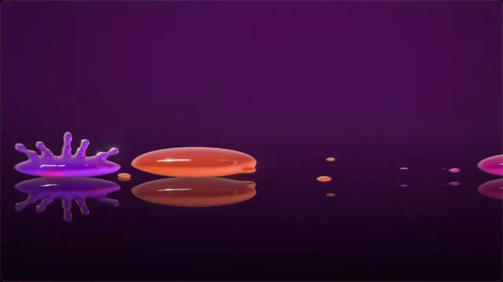
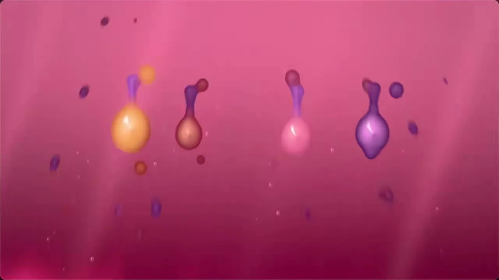
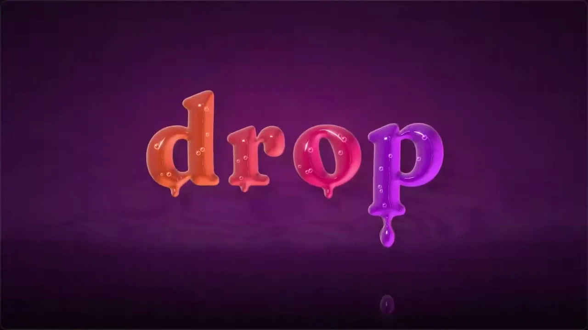

# 14 · 液态流动 / Liquid Motion

> 果冻般可捏的液体,粘连拉丝融合弹跳

  

## 中文提示词

风格:SDF 融球液态,一切都是可捏的高光果冻
画面:李子紫底#3F1142压暗角;液体橙#E8582E→洋红#E0146E→紫#9B1FD6;半透明+强高光+菲涅尔边光;镜面地面倒影
字体:粗衬线小写,同材质果冻字挂液滴
动效:流畅30fps;拉丝断颈坠落,落地冠状飞溅;相邻形状平滑融合、交界混色;弹簧过冲约15%、0.5s收住,静止仍微颤;转场=液浪擦屏约4帧,或聚团爆开+冲击环
实现:WebGL raymarch SDF+smin,算高光/折射/倒影
不要:扁平填色;硬边不相融;线性匀速;冷色
内容:{在这里写你的内容}

## English Prompt

Style: SDF metaball liquid; everything is glossy, squeezable jelly
Look: plum bg #3F1142 with dark vignette; liquids orange #E8582E → magenta #E0146E → violet #9B1FD6; translucent, hard specular, fresnel rim; mirror floor reflections, centered
Type: bold lowercase serif in the same jelly material, drips on the baseline
Motion: smooth 30fps; stretch, pinch-off and fall, crown splash on landing; neighbours smooth-merge with blended seams; spring ~15% overshoot settling in 0.5s, idle wobble; transitions = liquid surge wipe (~4 frames) or fuse into one blob, burst + shockwave ring
Build: WebGL raymarched SDF + smin, normals for specular/refraction/floor reflection
Avoid: flat fills; hard shapes that never merge; linear motion; cold palette
Content: {your content here}
