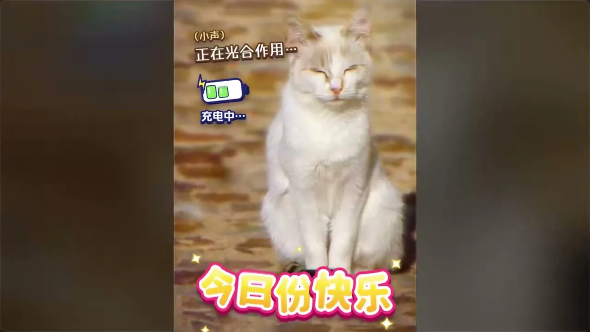
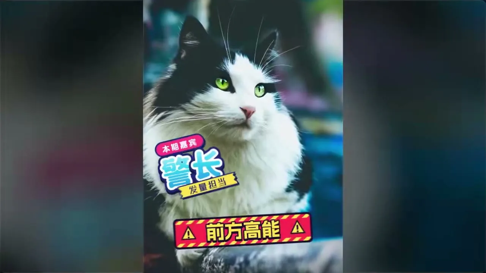
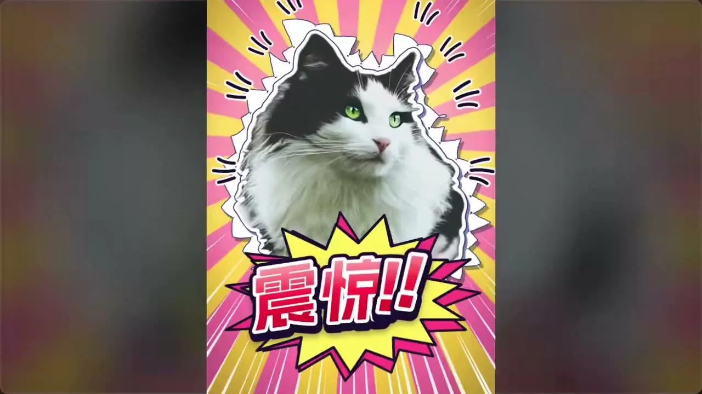

# 15 · 综艺花字 / Variety Show Captions

**招牌(一眼认出的特征)**

- 花字本体:超粗圆胖字形 + 亮色渐变字面 + 白/彩/深色多层描边 + 错位硬投影,厚得像贴纸
- 万物贴纸化:任何主体都抠出包白色贴纸边,配爆炸框、集中线、闪星,铺在高饱和糖果色斜条纹或放射光芒上
- 逐字弹跳砸落:字一个个蹦出过冲回弹,重点字从大处砸下配一帧白闪

  

## 中文提示词

综艺花字风,9:16 竖屏。招牌:胖字裹多层描边成贴纸、万物贴纸化、逐字弹跳砸落。
① 造型与材质:字用超粗圆胖字形,字面填亮色渐变,由内向外裹白边、彩边、深色最外边,再压错位硬投影,厚如贴纸;字身微斜、基线错落。任何主体抠出后都包一圈白色贴纸边,旁缀爆炸框、集中线、闪星。
② 配色与背景:高明度高饱和糖果色,三四个亮色轮换做主,深色只作勾边;背景是素材或纯色上铺斜条纹、放射光芒。
③ 运动规律:文字逐字蹦出,先放大过冲再回弹落定;重点字从大处砸下配一帧白闪;横幅和贴纸倾斜甩入带拖影,落定后轻颤;换段用彩色斜带一扫而过。
画面里出现什么、怎么编排,全部由内容决定;风格只决定它们怎么被画出来、怎么动。
内容:{在这里写你的内容}

## English Prompt

Variety-show caption style, 9:16 vertical. Signature: chubby type wrapped in stacked outlines like a sticker, everything turned into a sticker, per-character bouncy pop and slam.
1 Form & material: ultra-bold rounded chubby lettering, filled with a bright gradient, wrapped from inside out in a white stroke, a colored stroke and a dark outermost stroke, then a hard offset shadow, thick as a vinyl sticker; letters slightly tilted on a staggered baseline. Any subject is cut out and given a white sticker border, surrounded by comic burst shapes, focus lines and sparkles.
2 Color & background: high-brightness, high-saturation candy colors, three or four brights rotating as the lead, dark used only for outlines to anchor; backgrounds are footage or flat color overlaid with diagonal stripes or radiating sunbursts, high contrast.
3 Motion: text pops in character by character, overshooting then springing back to rest; key words slam down from large with a single-frame white flash; banners and stickers swing in tilted with motion smear and jitter slightly once landed; sections change with a colored diagonal band sweeping across.
What appears on screen and how it is arranged is decided entirely by the content; the style only decides how things are drawn and how they move.
Content: {your content here}
